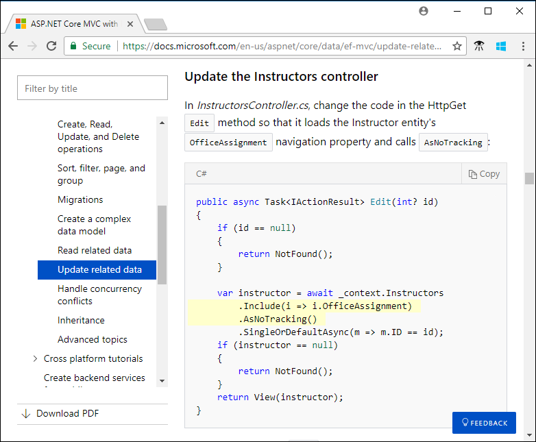

# How to include code in documentation

There are several ways other than [screenshots](#screenshots) to include code in an article published on Microsoft Learn:

* Individual elements (words) within a line.

  Here's an example of `code` style.

  Use code format when referring to named parameters and variables in a nearby code block in your text. Code format may also be used for properties, methods, classes, and language keywords. For more information, see [Code elements](#code-elements) later in this article..

* Code blocks in the article Markdown file.

  ```markdown
      ```csharp
      public static void Log(string message)
      {
          _logger.LogInformation(message);
      }
      ```
  ```

  Use inline code blocks when it's impractical to display code by reference to a code file. For more information, see [Code blocks](#inline-code-blocks) later in this article.

* Code blocks by reference to a code file in the local repository.

  ```markdown
  :::code language="csharp" source="intro/samples/cu/Controllers/StudentsController.cs" range="2-24,26":::
  ```

  For more information, see [In-repo snippet references](#in-repo-snippet-references) later in this article.

* Code blocks by reference to a code file in another repository.

  ```markdown
  :::code language="csharp" source="~/samples-durable-functions/samples/csx/shared/Location.csx" highlight="2,5":::
  ```
  
  For more information, see [Out-of-repo snippet references](#out-of-repo-snippet-references) later in this article.
  
* Code blocks that let the user execute code in the browser.

   ```markdown
  :::code source="PowerShell.ps1" interactive="cloudshell-powershell":::
  ```

  For more information, see [Interactive code snippets](#interactive-code-snippets) later in this article.

Besides explaining the Markdown for each of these ways to include code, the article provides some
[general guidance for all code blocks](#code-blocks).

## Code elements

A "code element" is a programming language keyword, class name, property name, and so forth. It's
not always obvious what qualifies as code. For example, NuGet package names should be treated as
code. When in doubt, see [Text formatting guidelines](text-formatting-guidelines.md).

## Inline code style

To include a code element in article text, surround it with backticks (\`) to indicate code style.
Inline code style shouldn't use the triple-backtick format.

|Markdown |Rendered |
|---------|---------|
|By default, the Entity Framework interprets a property that's named \`Id\` or \`ClassnameID\` as the primary key.|By default, the Entity Framework interprets a property that's named `Id` or `ClassnameID` as the primary key.|

When an article is localized (translated into other languages), text styled as code is left
untranslated. If you want to prevent localization without using code style, see [Non-localized strings](markdown-reference.md#non-localized-strings).

## Bold style

Some older style guides specify bold for inline code. Bold is an option when code style is so
obtrusive as to compromise readability. For example, a Markdown table with mostly code elements
might look too busy with code styling everywhere. If you choose to use bold style, use [non-localized strings syntax](markdown-reference.md#non-localized-strings) to make sure that code is not localized.

## Links

A link to reference documentation may be more helpful than code format in some contexts. If you use a link, don't apply code format to the link text. Styling a link as code can obscure the fact that the text is a link.

If you use a link and refer to the same element later in the same context, make the subsequent instances code format rather than links. For example:

```markdown
The first reference to <xref:System.CommandLine> in this text is a link.
Subsequent references to `System.CommandLine` can be in code style.
```

Rendered:

The first reference to <xref:System.CommandLine> in this text is a link.
Subsequent references to `System.CommandLine` can be in code style.

## Placeholders

If you want the user to replace a section of displayed code with their own values, use placeholder
text marked off by angle brackets. For example:

> `az group delete -n <ResourceGroupName>`  

You may note that the brackets must be removed when substituting real values. The Microsoft Writing Style Guide calls for italics, which you may format within angle bracketed inline code:

> *`<ResourceGroupName>`* is the resource group where...

Curly braces { } are discouraged for use as syntactical placeholders. They may be confused with the same notation used in replaceable text, format strings, string interpolation, text templates, and similar programming constructs.

Placeholder names can be separated by hyphens ("kebab case"), with underscores, or not separated at all (Pascal case). Kebab case may generate syntax errors and underscores may conflict with underlining. All-caps may conflict with named constants in many languages, though it may also draw attention to the placeholder name.

> *`<Resource-Group-Name>`* or *`<ResourceGroupName>`*

## Code blocks

The syntax for including code in a doc depends on where the code is located:

* [In the article Markdown file](#inline-code-blocks)
* [In a code file in the same repository](#in-repo-snippet-references)
* [In a code file in a different repository](#out-of-repo-snippet-references)

Following are guidelines that apply to all three types of code blocks:

* [Screenshots](#screenshots)
* [Automate code validation](#code-validation)
* [Highlight key lines of code](#highlighting)
* [Avoid horizontal scroll bars](#horizontal-scroll-bars)
* [Clearly identify bad code](#horizontal-scroll-bars)

### Screenshots

All of the methods listed in the preceding section result in usable code blocks:

* You can copy and paste from them.
* They're indexed by search engines.
* They're accessible to screen readers.

These are just a few of the reasons why IDE screenshots aren't recommended as a method of including
code in an article. Use IDE screenshots for code only if you're showing something about the IDE
itself, like IntelliSense. Don't use screenshots just to show colorization and highlighting.

### Code validation

Some repositories have implemented processes that automatically compile all sample code to check for
errors. The .NET repository does this. For more information,
see [Contributing](https://github.com/dotnet/docs/blob/main/CONTRIBUTING.md) in the .NET
repository.

If you are including code blocks from another repository, work with the owners on a maintenance strategy for the code so that
your included code does not break or go out of date as new versions of the libraries the code uses are shipped.

### Highlighting

Snippets typically include more code than necessary in order to provide context. It helps
readability when you highlight the key lines that you're focusing on in the snippet, as in this
example:



You can't highlight code when you include it in the article Markdown file. It works only for code
snippets included by reference to a code file.

### Horizontal scroll bars

Break up long lines to avoid horizontal scroll bars. Scroll bars on code blocks make code hard to
read. They're especially problematic on longer code blocks, where it may be impossible to see the
scroll bar and the line you want to read at the same time.

A good practice for minimizing horizontal scroll bars on code blocks is to break up code lines
longer than 85 characters. But keep in mind that the presence or absence of a scroll bar isn't the
only criterion of readability. If breaking a line before 85 hurts readability or copy-paste convenience, feel
free to go over 85.

### Clearly identify bad code

In some scenarios, it's helpful to point out coding patterns that should be avoided, for example:

* Code that will cause a compiler error if attempted.
* Code that will compile correctly but is not recommended.

For these scenarios:

* Explain the error both in code comments and article text.

  Readers often skip article text and look only at code, so it's not enough to explain the error only in article text. It's also not enough to explain the error only in code comments, because code comments aren't localized.

* Consider commenting out the code if it would cause a compiler error.

  Commented-out code won't disrupt the continuous integration (CI) system if the article's repo has one now or implements one in the future.

For an example of how to present code that isn't recommended, see [Rune usage example: changing letter case](/dotnet/standard/base-types/character-encoding-introduction#rune-usage-example-changing-letter-case). In this example, the advice to avoid it is even built into the code itself, as the C# method name is `ConvertToUpperBadExample`.

## Inline code blocks

Use inline code blocks only when it's impractical to display code by reference to a code file. Inline code is generally more difficult to test and keep up to date compared to a code file that is part of a complete project.  And inline code may omit context that could help the developer to understand and use the code. These considerations apply mainly to programming languages. Inline code blocks can also be used for outputs and inputs (such as JSON), query languages (such as SQL), and scripting languages (such as PowerShell).
  
There are two ways to indicate a section of text in an article file is a code block: by *fencing* it
in triple-backticks (\`\`\`) or by indenting it. Fencing is preferred because it lets you specify
the language. Avoid using indentation because it's too easy to get wrong and it may be hard for
another writer to understand your intent when they need to edit your article.

Language indicators are placed immediately after the opening triple-backticks, as in
the following example:

Markdown:

```markdown
    ```json
    {
        "aggregator": {
            "batchSize": 1000,
            "flushTimeout": "00:00:30"
        }
    }
    ```
```

Rendered:

```json
{
    "aggregator": {
        "batchSize": 1000,
        "flushTimeout": "00:00:30"
    }
}
```

> [!TIP]
> [GitHub Flavored Markdown](https://github.github.com/gfm/#fenced-code-blocks) supports delimiting code blocks with tildes (~) as well as with backticks (`).
> The symbol used to open and close the code block must be consistent within the same code block.

For information about the values you can use as language indicators, see
[Language names and aliases](http://highlightjs.readthedocs.io/en/latest/css-classes-reference.html#language-names-and-aliases).

If you use a language or environment word after the triple-backticks (\`\`\`) that isn't supported,
that word appears in the code section title bar on the rendered page. Whenever possible, use a language or
environment indicator in your inline code blocks.

> [!NOTE]
> If you copy and paste code from a Word document, make sure it has no "curly quotes," which aren't valid in code. If it does, change them back to normal quotes (`'` and `"`). Alternatively, rely on the Learn Authoring Pack, [smart quotes replacement feature](docs-authoring/smart-quote-replacement.md).

## In-repo snippet references

The preferred way to include code snippets for programming languages in docs is by reference to a code file. This method gives you the ability to highlight lines of code and makes the wider context of the snippet available on GitHub for developers to use. You can include code by using the triple colon format (:\:\:) either manually or in Visual Studio Code with the help of the [Learn Authoring Pack](https://marketplace.visualstudio.com/items?itemName=docsmsft.docs-authoring-pack).

1. In Visual Studio Code, click <kbd>Alt + M</kbd> or <kbd>Option + M</kbd> and select Snippet.
2. Once Snippet is selected, you will be prompted for Full Search, Scoped Search or Cross-Repository Reference. To search locally, select Full Search.
3. Enter a search term to find the file. Once you've found the file, select the file.
4. Next, select an option to determine which line(s) of code should be included in the snippet. The options are: **ID**, **Range** and **None**.
5. Based on your selection from Step 4, provide a value if necessary.

Display entire code file:

```markdown
:::code language="csharp" source="intro/samples/cu/Controllers/StudentsController.cs":::
```

Display part of a code file by specifying line numbers:

```markdown
:::code language="csharp" source="intro/samples/cu/Controllers/StudentsController.cs" range="2-24,26":::
```

Display part of a code file by specifying a snippet name:

```markdown
:::code language="csharp" source="intro/samples/cu/Controllers/StudentsController.cs" id="snippet_Create":::
```

The following sections explain these examples:

* [Use a relative path to the code file](#path-to-code-file)
* [Include only selected line numbers](#selected-line-numbers)
* [Refer to a named snippet](#named-snippet)
* [Highlight selected lines](#highlighting-selected-lines)

For more information, see [Snippet syntax reference](#snippet-syntax-reference) later in this
article.

### Path to code file

Example:

```markdown
:::code language="csharp" source="intro/samples/cu/Controllers/StudentsController.cs" range="2-24,26":::
```

The example is from the ASP.NET docs repo, [aspnetcore/data/ef-mvc/crud.md](https://github.com/dotnet/AspNetCore.Docs/blob/main/aspnetcore/data/ef-mvc/crud.md)
article file. The code file is referenced by a relative path to
[aspnetcore/data/ef-mvc/intro/samples/cu/Controllers/StudentsController.cs](https://github.com/dotnet/AspNetCore.Docs/blob/main/aspnetcore/data/ef-mvc/intro/samples/cu/Controllers/StudentsController.cs)
in the same repository.

### Selected line numbers

Example:

```markdown
:::code language="csharp" source="intro/samples/cu/Controllers/StudentsController.cs" range="2-24,26":::
```

This example displays only lines 2-24 and 26 of the *StudentController.cs* code file.

Prefer named snippets over hard-coded line numbers, as explained in the next section.

### Named snippet

Example:

```markdown
:::code language="csharp" source="intro/samples/cu/Controllers/StudentsController.cs" id="snippet_Create":::
```

Use only letters and underscores for the name.

The example displays the `snippet_Create` section of the code file. The code file for this example
has snippet tags in comments in the C# code:

```cs
// code excluded from the snippet
// <snippet_Create>
// code included in the snippet
// </snippet_Create>
// code excluded from the snippet
```

Named code snippets can be nested, as shown in the following example:

```cs
// <Method>
public static void SomeMethod()
{
    // <Line>
    // Single line of code.
    // </Line>
}
// </Method>
```

When the `Method` code snippet is rendered, the `Line` tags aren't included in the rendered output.

Whenever you can, refer to a named section rather than specifying line numbers. Line number
references are brittle because code files inevitably change in ways that make line numbers change.
You don't necessarily get notified of such changes. Your article eventually starts showing the wrong
lines and you have no clue anything has changed.

### Highlighting selected lines

Example:

```markdown
:::code language="csharp" source="intro/samples/cu/Controllers/StudentsController.cs" range="2-24,26" highlight="2,5":::
```

The example highlights lines 2 and 5, counting from the start of the displayed snippet. Line
numbers to highlight don't count from the start of the code file. In other words, lines 3 and 6
of the code file are highlighted.

## Out-of-repo snippet references

If the code file you want to reference is in a different repository, set up the code
repository as a *dependent repository*. When you do that, you specify a name for it. That name then
acts like a folder name for purposes of code references.

For example, the docs repository is *Azure/azure-docs*, and the code repository is
*Azure/azure-functions-durable-extension*.

In the root folder of *azure-docs*, add the following section in
*.openpublishing.publish.config.json*:

```json
    {
      "path_to_root": "samples-durable-functions",
      "url": "https://github.com/Azure/azure-functions-durable-extension",
      "branch": "main",
      "branch_mapping": {}
    },
```

Now when you refer to *samples-durable-functions* as if it were a folder in *azure-docs*, you're
actually referring to the root folder in the *azure-functions-durable-extension* repository.

You can include code by using the triple colon format (:\:\:) either manually or in Visual Studio Code with the help of the [Learn Authoring Pack](https://marketplace.visualstudio.com/items?itemName=docsmsft.docs-authoring-pack).

1. In Visual Studio Code, click <kbd>Alt + M</kbd> or <kbd>Option + M</kbd> and select Snippet.
2. Once Snippet is selected, you will be prompted for Full Search, Scoped Search or Cross-Repository Reference. To search across repositories, select Cross-Repository Reference.
3. You will be given a selection of repositories that are in *.openpublishing.publish.config.json*. Select a repository.
4. Enter a search term to find the file. Once you've found the file, select the file.
5. Next, select an option to determine which line(s) of code should be included in the snippet. The options are: **ID**, **Range** and **None**.
6. Based on your selection from Step 5, provide a value.

Your snippet reference will look like this:

```markdown
:::code language="csharp" source="~/samples-durable-functions/samples/csx/shared/Location.csx" highlight="2,5":::
```

In the *azure-functions-durable-extension* repository, that code file is in the *samples/csx/shared*
folder. As noted [earlier](#highlighting-selected-lines), line numbers for highlighting are relative to the start of the snippet rather than the start of the file.

> [!NOTE]
> The name you assign to the dependent repository is relative to the root of the main repository, but the tilde (`~`) refers to the root of the docset. The docset root is determined by `build_source_folder` in `.openpublishing.publish.config.json`. The path to the snippet in the preceding example works in the azure-docs repo because `build_source_folder` refers to the repo root (`.`). If `build_source_folder` were `articles`, the path would start with `~/../samples-durable-functions` instead of `~/samples-durable-functions`.

## Snippets in a Jupyter notebook

You can reference a cell in a Jupyter notebook as a code snippet. In order to reference the cell:

1. Add cell metadata to the notebook for the cells you wish to reference.
1. Set up access to the repository.
1. Use Jupyter notebook snippet syntax in your markdown file.

### Add metadata to notebook

1. Name the cell by adding cell metadata in the Jupyter notebook.  

    * In Jupyter, you can [edit cell metadata](https://jupyterbook.org/content/metadata.html#adding-tags-using-notebook-interfaces) by first enabling the the cell toolbar:  **View > Cell Toolbar > Edit Metadata**.
    * Once the cell toolbar is enabled, select **Edit Metadata** on the cell you wish to name.
    * Or you can edit metadata directly in the notebook's JSON structure.

1. In the cell metadata, add a "name" attribute:

    ```json
    "metadata": {"name": "<name>"},
    ```
  
    For example:

    ```json
    "metadata": {"name": "workspace"},
    ```

    > [!TIP]
    > You can add any other metadata you'd like to help you track where the cell is being used.  For example:
    >
    > ```json
    >     "metadata": {
    >       "name": "workspace",
    >       "msdoc": "how-to-track-experiments.md"
    >     },
    > ```

### Set up repository access

If the notebook file you want to reference is in a different repository, set up the code repository as a [dependent repository](#out-of-repo-snippet-references).

### Jupyter notebook snippet syntax reference

 Once your notebook contains the required metadata, reference it in your markdown file. Use the `<cell-name-value>` you added to the notebook, and the `<path>` you set up as your dependent repository.

```markdown
[!notebook-<language>[] (<path>/<notebook-name.ipynb>?name=<cell-name-value>)]
```

For example:

```markdown
[!notebook-python[] (~/MachineLearningNotebooks/train-on-local.ipynb?name=workspace)]
```

> [!IMPORTANT]
> This syntax is a block Markdown extension. It must be used on its own line.

Use any of the [supported languages](#supported-languages) for the `<language>` identifier.

## Interactive code snippets

### Inline interactive code blocks

For the following languages, code snippets can be made executable in the browser window:

* Azure Cloud Shell
* Azure PowerShell Cloud Shell
* C# REPL

When interactive mode is enabled, the rendered code boxes have a **Try It** or **Run** button. For
example:

```markdown
    ```azurepowershell-interactive
    New-AzResourceGroup -Name myResourceGroup -Location westeurope
    ```
```

renders as follows:

```azurepowershell-interactive
New-AzResourceGroup -Name myResourceGroup -Location westeurope
```

And

```md
    ```csharp-interactive
    var aFriend = "Maria";
    Console.WriteLine($"Hello {aFriend}");
    ```
```

renders as:

```csharp-interactive
    var aFriend = "Maria";
    Console.WriteLine($"Hello {aFriend}");
```

To turn on this feature for a particular code block, use a special language identifier. The
available options are:

* `azurepowershell-interactive` - Enables the Azure PowerShell Cloud Shell, as in the preceding
  example
* `azurecli-interactive` - Enables the Azure Cloud Shell
* `csharp-interactive` - Enables the C# REPL

For the Azure Cloud Shell and PowerShell Cloud Shell, users can run commands against only their own
Azure account.

### Code snippets included by reference

You can enable interactive mode for code snippets included by reference. 
To turn on this feature for a particular code block, use the `interactive` attribute. The
available attribute values are:

* `cloudshell-powershell` - Enables the Azure PowerShell Cloud Shell, as in the preceding
  example
* `cloudshell-bash` - Enables the Azure Cloud Shell
* `try-dotnet` - Enables Try .NET
* `try-dotnet-class` - Enables Try .NET with class scaffolding
* `try-dotnet-method` - Enables Try .NET with method scaffolding

Here are some examples:

```md
:::code source="PowerShell.ps1" interactive="cloudshell-powershell":::
```

```md
:::code source="Bash.sh" interactive="cloudshell-bash":::
```

For the Azure Cloud Shell and PowerShell Cloud Shell, users can only run commands against their own
Azure account.

For the .NET Interactive experience, the contents of your code block depends on which of the three scaffolding experiences you choose:

* *No scaffolding* (`try-dotnet`): The code block should represent a full program text. For example, the *Program.cs* file generated by `dotnet new console` would be valid. These are most useful to show an entire small program, including the `using` directives needed. Top level statements are not supported at this time.
* *Method scaffolding* (`try-dotnet-method`): The code block should represent the content of a `Main` method in a console application. You can assume the `using` directives added by the `dotnet new console` template. This setting is most useful for short snippets that demonstrate one feature.
* *Class scaffolding* (`try-dotnet-class`): The code block should represent a class with a `Main` method as the program entry point. These can be used to show how members of a class interact.

## Snippet syntax reference

Syntax:

```md
:::code language="<language>" source="<path>" <attribute>="<attribute-value>":::
```

> [!IMPORTANT]
> This syntax is a block Markdown extension. It must be used on its own line.

* `<language>` (*optional*)
  * Language of the code snippet. For more information, see the [Supported languages](#supported-languages)
    section later in this article.

* `<path>` (*mandatory*)
  * Relative path in the file system that indicates the code snippet file to reference.

* `<attribute>` and `<attribute-value>` (*optional*)
  * Used together to specify how the code should be retrieved from the file and how it should be displayed:
    * `range`: `1,3-5` A range of lines. This example includes lines 1, 3, 4, and 5.
    * `id`: `Create` The ID of the snippet that needs to be inserted from the code file. This value cannot coexist with range.
    * `highlight`: `2-4,6` Range and/or numbers of lines that need to be highlighted in the generated code snippet. The numbering is relative to the lines displayed (as specified by range or id), not the file.
    * `interactive`: `cloudshell-powershell`, `cloudshell-bash`, `try-dotnet`, `try-dotnet-class`, `try-dotnet-method` String value determines what kinds of interactivity are enabled.
    * For details about tag name representation in code snippet source files by language, see the [DocFX guidelines](https://dotnet.github.io/docfx/spec/docfx_flavored_markdown.html#tag-name-representation-in-code-snippet-source-file).

## Supported languages

The [Learn Authoring Pack](how-to-write-docs-auth-pack.md) includes a feature to provide statement completion and validation of the available language identifiers for code fence blocks.

### Fenced code blocks

| Name                           | Valid aliases                                                                  |
|--------------------------------|--------------------------------------------------------------------------------|
| .NET Core CLI                  | `dotnetcli`                                                                    |
| 1C                             | `1c`                                                                           |
| ABNF                           | `abnf`                                                                         |
| Access logs                    | `accesslog`                                                                    |
| Ada                            | `ada`                                                                          |
| ARM assembler                  | `armasm`, `arm`                                                                |
| AVR assembler                  | `avrasm`                                                                       |
| ActionScript                   | `actionscript`, `as`                                                           |
| Alan                           | `alan`, `i`                                                                    |
| AngelScript                    | `angelscript`, `asc`                                                           |
| ANTLR                          | `antlr`                                                                        |
| Apache                         | `apache`, `apacheconf`                                                         |
| AppleScript                    | `applescript`, `osascript`                                                     |
| Arcade                         | `arcade`                                                                       |
| AsciiDoc                       | `asciidoc`, `adoc`                                                             |
| AspectJ                        | `aspectj`                                                                      |
| ASPX                           | `aspx`                                                                         |
| ASP.NET (C#)                   | `aspx-csharp`                                                                  |
| ASP.NET (VB)                   | `aspx-vb`                                                                      |
| AutoHotkey                     | `autohotkey`                                                                   |
| AutoIt                         | `autoit`                                                                       |
| Awk                            | `awk`, `mawk`, `nawk`, `gawk`                                                  |
| Axapta                         | `axapta`                                                                       |
| AzCopy                         | `azcopy`                                                                       |
| Azure CLI                      | `azurecli`                                                                     |
| Azure CLI (Interactive)        | `azurecli-interactive`                                                         |
| Azure Powershell               | `azurepowershell`                                                              |
| Azure Powershell (Interactive) | `azurepowershell-interactive`                                                  |
| Bash                           | `bash`, `sh`, `zsh`                                                            |
| Basic                          | `basic`                                                                        |
| BNF                            | `bnf`                                                                          |
| C                              | `c`                                                                            |
| C#                             | `csharp`, `cs`                                                                 |
| C# (Interactive)               | `csharp-interactive`                                                           |
| C++                            | `cpp`, `c`, `cc`, `h`, `c++`, `h++`, `hpp`                                     |
| C++/CX                         | `cppcx`                                                                        |
| C++/WinRT                      | `cppwinrt`                                                                     |
| C/AL                           | `cal`                                                                          |
| Cache Object Script            | `cos`, `cls`                                                                   |
| CMake                          | `cmake`, `cmake.in`                                                            |
| Coq                            | `coq`                                                                          |
| CSP                            | `csp`                                                                          |
| CSS                            | `css`                                                                          |
| Cap'n Proto                    | `capnproto`, `capnp`                                                           |
| Clojure                        | `clojure`, `clj`                                                               |
| CoffeeScript                   | `coffeescript`, `coffee`, `cson`, `iced`                                       |
| Crmsh                          | `crmsh`, `crm`, `pcmk`                                                         |
| Crystal                        | `crystal`, `cr`                                                                |
| Cypher (Neo4j)                 | `cypher`                                                                       |
| D                              | `d`                                                                            |
| DAX Power BI                   | `dax`                                                                          |
| DNS Zone file                  | `dns`, `zone`, `bind`                                                          |
| DOS                            | `dos`, `bat`, `cmd`                                                            |
| Dart                           | `dart`                                                                         |
| Delphi                         | `delphi`, `dpr`, `dfm`, `pas`, `pascal`, `freepascal`, `lazarus`, `lpr`, `lfm` |
| Diff                           | `diff`, `patch`                                                                |
| Django                         | `django`, `jinja`                                                              |
| Dockerfile                     | `dockerfile`, `docker`                                                         |
| dsconfig                       | `dsconfig`                                                                     |
| DTS (Device Tree)              | `dts`                                                                          |
| Dust                           | `dust`, `dst`                                                                  |
| Dylan                          | `dylan`                                                                        |
| EBNF                           | `ebnf`                                                                         |
| Elixir                         | `elixir`                                                                       |
| Elm                            | `elm`                                                                          |
| Erlang                         | `erlang`, `erl`                                                                |
| Excel                          | `excel`, `xls`, `xlsx`                                                         |
| Extempore                      | `extempore`, `xtlang`, `xtm`                                                   |
| F#                             | `fsharp`, `fs`                                                                 |
| FIX                            | `fix`                                                                          |
| Fortran                        | `fortran`, `f90`, `f95`                                                        |
| G-Code                         | `gcode`, `nc`                                                                  |
| Gams                           | `gams`, `gms`                                                                  |
| GAUSS                          | `gauss`, `gss`                                                                 |
| GDScript                       | `godot`, `gdscript`                                                            |
| Gherkin                        | `gherkin`                                                                      |
| GN for Ninja                   | `gn`, `gni`                                                                    |
| Go                             | `go`, `golang`                                                                 |
| Golo                           | `golo`, `gololang`                                                             |
| Gradle                         | `gradle`                                                                       |
| GraphQL                        | `graphql`                                                                       |
| Groovy                         | `groovy`                                                                       |
| HTML                           | `html`, `xhtml`                                                                |
| HTTP                           | `http`, `https`                                                                |
| Haml                           | `haml`                                                                         |
| Handlebars                     | `handlebars`, `hbs`, `html.hbs`, `html.handlebars`                             |
| Haskell                        | `haskell`, `hs`                                                                |
| Haxe                           | `haxe`, `hx`                                                                   |
| Hy                             | `hy`, `hylang`                                                                 |
| Ini                            | `ini`                                                                          |
| Inform7                        | `inform7`, `i7`                                                                |
| IRPF90                         | `irpf90`                                                                       |
| JSON                           | `json`                                                                         |
| Java                           | `java`, `jsp`                                                                  |
| JavaScript                     | `javascript`, `js`, `jsx`                                                      |
| Kotlin                         | `kotlin`, `kt`                                                                 |
| Kusto                          | `kusto`                                                                        |
| Leaf                           | `leaf`                                                                         |
| Lasso                          | `lasso`, `ls`, `lassoscript`                                                   |
| Less                           | `less`                                                                         |
| LDIF                           | `ldif`                                                                         |
| Lisp                           | `lisp`                                                                         |
| LiveCode Server                | `livecodeserver`                                                               |
| LiveScript                     | `livescript`, `ls`                                                             |
| Lua                            | `lua`                                                                          |
| Makefile                       | `makefile`, `mk`, `mak`                                                        |
| Markdown                       | `markdown`, `md`, `mkdown`, `mkd`                                              |
| Mathematica                    | `mathematica`, `mma`, `wl`                                                     |
| Matlab                         | `matlab`                                                                       |
| Maxima                         | `maxima`                                                                       |
| Maya Embedded Language         | `mel`                                                                          |
| Mercury                        | `mercury`                                                                      |
| mIRC Scripting Language        | `mirc`, `mrc`                                                                  |
| Mizar                          | `mizar`                                                                        |
| Managed Object Format          | `mof`                                                                          |
| Mojolicious                    | `mojolicious`                                                                  |
| Monkey                         | `monkey`                                                                       |
| Moonscript                     | `moonscript`, `moon`                                                           |
| MS Graph (Interactive)         | `msgraph-interactive`                                                          |
| N1QL                           | `n1ql`                                                                         |
| NSIS                           | `nsis`                                                                         |
| Nginx                          | `nginx`, `nginxconf`                                                           |
| Nimrod                         | `nimrod`, `nim`                                                                |
| Nix                            | `nix`                                                                          |
| OCaml                          | `ocaml`, `ml`                                                                  |
| Objective C                    | `objectivec`, `mm`, `objc`, `obj-c`                                            |
| OpenGL Shading Language        | `glsl`                                                                         |
| OpenSCAD                       | `openscad`, `scad`                                                             |
| Oracle Rules Language          | `ruleslanguage`                                                                |
| Oxygene                        | `oxygene`                                                                      |
| PF                             | `pf`, `pf.conf`                                                                |
| PHP                            | `php`, `php3`, `php4`, `php5`, `php6`                                          |
| Parser3                        | `parser3`                                                                      |
| Perl                           | `perl`, `pl`, `pm`                                                             |
| Plaintext no highlight         | `plaintext`                                                                    |
| Pony                           | `pony`                                                                         |
| PostgreSQL & PL/pgSQL          | `pgsql`, `postgres`, `postgresql`                                              |
| PowerShell                     | `powershell`, `ps`                                                             |
| PowerShell (Interactive)       | `powershell-interactive`                                                       |
| Processing                     | `processing`                                                                   |
| Prolog                         | `prolog`                                                                       |
| Properties                     | `properties`                                                                   |
| Protocol Buffers               | `protobuf`                                                                     |
| Puppet                         | `puppet`, `pp`                                                                 |
| Python                         | `python`, `py`, `gyp`                                                          |
| Python profiler results        | `profile`                                                                      |
| Q#                             | `qsharp`                                                                       |
| Q                              | `k`, `kdb`                                                                     |
| QML                            | `qml`                                                                          |
| R                              | `r`                                                                            |
| Razor CSHTML                   | `cshtml`, `razor`, `razor-cshtml`                                              |
| ReasonML                       | `reasonml`, `re`                                                               |
| RenderMan RIB                  | `rib`                                                                          |
| RenderMan RSL                  | `rsl`                                                                          |
| Roboconf                       | `graph`, `instances`                                                           |
| Robot Framework                | `robot`, `rf`                                                                  |
| RPM spec files                 | `rpm-specfile`, `rpm`, `spec`, `rpm-spec`, `specfile`                          |
| Ruby                           | `ruby`, `rb`, `gemspec`, `podspec`, `thor`, `irb`                              |
| Rust                           | `rust`, `rs`                                                                   |
| SAS                            | `SAS`, `sas`                                                                   |
| SCSS                           | `scss`                                                                         |
| SQL                            | `sql`                                                                          |
| STEP Part 21                   | `p21`, `step`, `stp`                                                           |
| Scala                          | `scala`                                                                        |
| Scheme                         | `scheme`                                                                       |
| Scilab                         | `scilab`, `sci`                                                                |
| Shape Expressions              | `shexc`                                                                        |
| Shell                          | `shell`, `console`                                                             |
| Smali                          | `smali`                                                                        |
| Smalltalk                      | `smalltalk`, `st`                                                              |
| Solidity                       | `solidity`, `sol`                                                              |
| Stan                           | `stan`                                                                         |
| Stata                          | `stata`                                                                        |
| Structured Text                | `iecst`, `scl`, `stl`, `structured-text`                                       |
| Stylus                         | `stylus`, `styl`                                                               |
| SubUnit                        | `subunit`                                                                      |
| Supercollider                  | `supercollider`, `sc`                                                          |
| Swift                          | `swift`                                                                        |
| Tcl                            | `tcl`, `tk`                                                                    |
| Terraform (HCL)                | `terraform`, `tf`, `hcl`                                                       |
| Test Anything Protocol         | `tap`                                                                          |
| TeX                            | `tex`                                                                          |
| Thrift                         | `thrift`                                                                       |
| TOML                           | `toml`                                                                         |
| TP                             | `tp`                                                                           |
| Twig                           | `twig`, `craftcms`                                                             |
| TypeScript                     | `typescript`, `ts`                                                             |
| VB.NET                         | `vbnet`, `vb`                                                                  |
| VBScript                       | `vbscript`, `vbs`                                                              |
| VHDL                           | `vhdl`                                                                         |
| Vala                           | `vala`                                                                         |
| Verilog                        | `verilog`, `v`                                                                 |
| Vim Script                     | `vim`                                                                          |
| Visual Basic                   | `vb`                                                                           |
| Visual Basic for Applications  | `vba`                                                                          |
| X++                            | `xpp`                                                                          |
| x86 Assembly                   | `x86asm`                                                                       |
| XL                             | `xl`, `tao`                                                                    |
| XQuery                         | `xquery`, `xpath`, `xq`                                                        |
| XAML                           | `xaml`                                                                         |
| XML                            | `xml`, `xhtml`, `rss`, `atom`, `xjb`, `xsd`, `xsl`, `plist`                    |
| YAML                           | `yml`, `yaml`                                                                  |
| Zephir                         | `zephir`, `zep`                                                                |

> [!TIP]
> The Learn Authoring Pack, [Dev Lang Completion feature](docs-authoring/dev-lang-completion.md) uses the first valid alias when multiple aliases are available.

## Next steps

For information on text formatting for content types other than code, see [Text formatting guidelines](text-formatting-guidelines.md).
