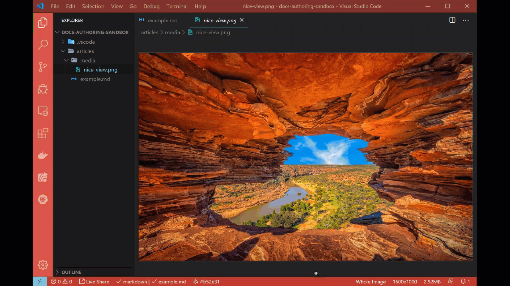

# Image compression

[!INCLUDE [image-extension](includes/image-extension.md)]

## Summary

All documentation is provided via the web, with the exception of PDF versions of documentation articles. When serving static content, it's best to minimize the number of bytes sent over the wire. One way to do that is to compress images at rest.

The Learn Images extension within the Learn Authoring Pack includes image compression context menu items. The following image types / extensions are supported:

* *\*.png*
* *\*.jpg*
* *\*.jpeg*
* *\*.gif*
* *\*.svg*
* *\*.webp*

The lossless image compression algorithms are used, where applicable.

## Compress image

From the **Explorer** navigation pane, right-click on an image file - then select the **Compress image** option. The image is then compressed.

## Compress images in folder

From the **Explorer** navigation pane, right-click on a folder containing images - then select the **Compress images in folder** option. All images in the folder are compressed.

## Considerations

Large resolution images are implicitly resized. The maximum dimensions are based on the platform suggested max width of `1,200px`. The max is only used when images are larger than they're recommended to be. They maintain the aspect ratio when automatically resized.

## Preferences

The maximum dimensions are configurable, but a default max width of `1200` pixels exists. To configure the max dimensions, select **File -> Preferences -> Settings** and filter by `"Learn Images Extension"`.

:::image type="content" source="media/configure-image-compression.png" alt-text="Configure image compression":::

> [!NOTE]
> A value of `0` in either the **Max Width** or **Max Height** will simply ignore resolution variances.

## In action

Below is a brief demonstration of this feature.

