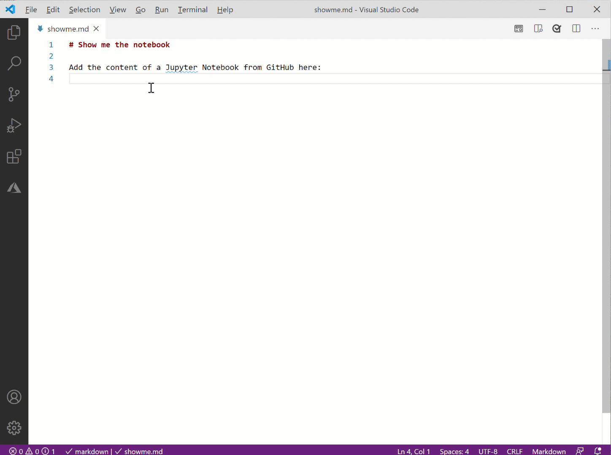

# Insert and update content from a Jupyter notebook

[!INCLUDE [markdown-extension](includes/markdown-extension.md)]

> [!IMPORTANT]
> Insert and update from a Jupyter notebook functionality does not currently work on a Mac.

## Summary

Jupyter Notebooks are a standard interactive way of creating and sharing code in the Python world.  The notebook contains a combination of Python code, markdown, and optionally output from the code.


The Learn Authoring Pack extension includes functionality to put a static markdown version of a Jupyter notebook into your document:

**Learn: Insert Jupyter notebook**: Enter the URL of the notebook. A markdown version of the notebook is added to the document at the position of your cursor. Do not modify the start or end tags; it's what the next function uses to update the notebook.

**Learn: Update Jupyter notebook**: This function will replace the previously inserted notebook content between start and end with the latest version. No need to enter the URL, it's recorded in the start tag.  Update functionality assumes there is a single notebook in the document.  Don't add multiple notebooks to a single document.

## Access the functions

* Type **Ctrl + Shift + P** to open the Command Palette, then start to type the name of the function until you see it.  Select the function.
* You can also access **Insert Jupyter notebook** from the the Learn Markdown Authoring menu by typing **Alt + M**.  Scroll down to find **Jupyter Notebook**. 

## In action

Below is a brief demonstration of this feature.

[](media/insertnotebook.gif#lightbox)

## Troubleshooting

> [!IMPORTANT]
> Insert and update from a Jupyter notebook functionality does not currently work on a Mac.

These functions need Python, `jupyter`, and `nbconvert` installed on your machine.

To see if Python is installed, open a VS Code terminal and run:

* Windows - `where python`
* Linux/Mac - `which python`

If the return is one or more paths, Python is installed.  If not, [install Python](https://www.python.org/downloads/) now.

Next make sure `jupyter` is installed:

* Windows - `where jupyter`
* Linux/Mac - `which jupyter`

If a path is not returned, install `jupyter`:

```bash
pip install --upgrade jupyter
```

Once both Python and `jupyter` are installed, install `nbconvert`:

```bash
pip install --upgrade nbconvert
```
