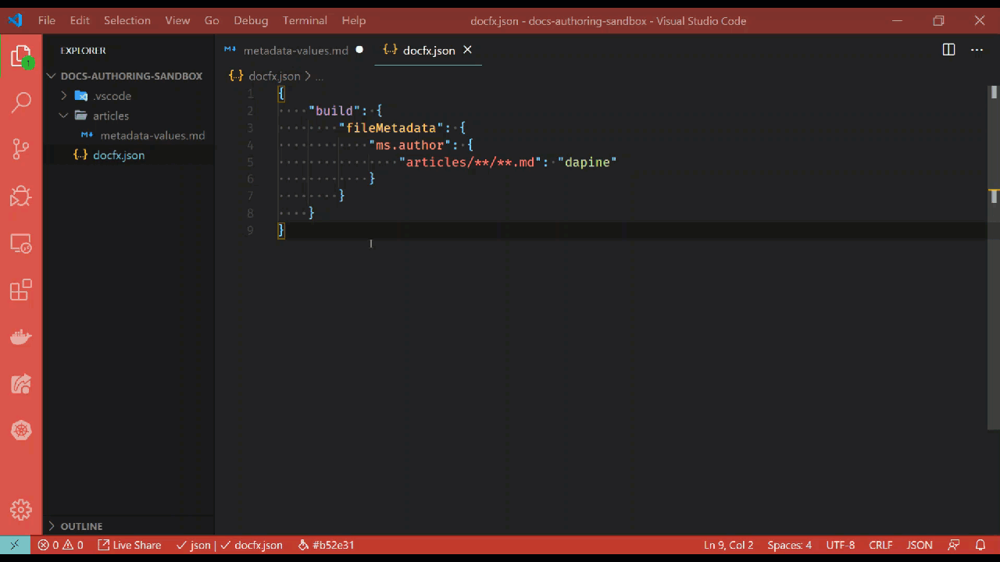

# Update metadata

[!INCLUDE [markdown-extension](includes/markdown-extension.md)]

## Summary

In a Markdown (*\*.md*) file, there are two contextual menu items specific to metadata. When you right-click anywhere in the text editor, you will see something similar to the following menu items:

:::image type="content" source="media/update-metadata-menu.png" alt-text="Update metadata context menu":::

## Update `ms.date` metadata value

Selecting the **Update `ms.date` Metadata Value** option will set the current Markdown files `ms.date` value to today's date. If the document does not have an `ms.date` metadata field, no action is taken.

## Update implicit metadata values

Selecting the **Update implicit metadata values** option will find and replace all possible metadata values that could be implicitly specified. Metadata values are implicitly specified in the *docfx.json* file, under the `build/fileMetadata` node. Each key value pair in the `fileMetadata` node represents metadata defaults. For example, a Markdown file in the *top-level/sub-folder* directory that omits the `ms.author` metadata value could implicitly specify a default value to use in the `fileMetadata` node.

```json
{
    "build": {
        "fileMetadata": {
            "ms.author": {
                "top-level/sub-folder/**/**.md": "dapine"
            }
        }
    }
}
```

In this case, all Markdown files would implicitly take on the `ms.author: dapine` metadata value. The feature acts on these implicit settings found in the *docfx.json* file. If a Markdown file contains metadata with values that are explicitly set to something other than the implicit values, they are overridden.

Consider the following Markdown file metadata, where this Markdown file resides in **top-level/sub-folder/includes/example.md**:

```markdown
---
ms.author: someone-else
---

# Content
```

If the **Update implicit metadata values** option was executed on this file, with the assumed *docfx.json* content from above the metadata value would be updated to `ms.author: dapine`.

```markdown
---
ms.author: dapine
---

# Content
```

## In action

Below is a brief demonstration of this feature.

[](media/update-metadata.gif#lightbox)
