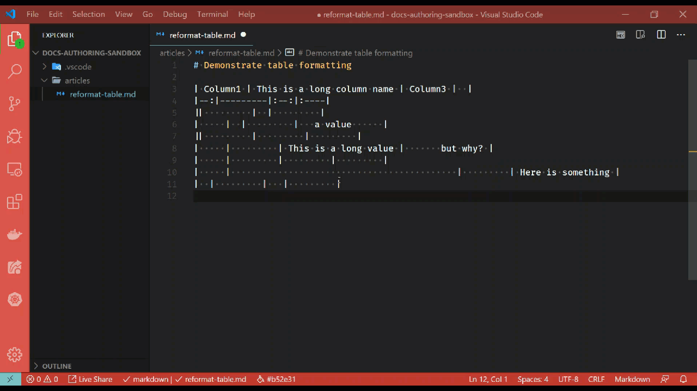

# Reformat Markdown tables

[!INCLUDE [markdown-extension](includes/markdown-extension.md)]

## Summary

In a Markdown (*\*.md*) file, when you select a complete table - two table formatting context menu items are now available. Right-click on the selected Markdown table to open the context menu. You will see something similar to the following menu items:

:::image type="content" source="media/reformat-table-menu.png" alt-text="Reformat table context menu":::

> [!TIP]
> This feature **does not** work with multiple table selections, but rather is intended for a single Markdown table. You must select the entire table, including headings for desired results.

## Consolidate selected table

Selecting the **Consolidate selected table** option will collapse the table headings and contents with only a single space on either side of each value.

## Evenly distribute selected table

Selecting the **Evenly distribute selected table** option will calculate the longest value in each column and evenly distribute all the other values accordingly with space.

## Considerations

The feature will not impact the rendering of the table, but it will help to improve the readability of the table - thus making more maintainable. The reformatting table feature will keep column alignment intact.

Consider the following table:

```markdown
| Column1 | This is a long column name | Column3 |  |
|--:|---------|:--:|:----|
||         |  |         |
|     |  |         |   a value      |
||         |         |         |
|     |         | This is a long value |       but why? |
|     |         |         |         |
|     |                                           |         | Here is something |
|  |         |   |         |
```

After being "evenly distributed":

```markdown
| Column1 | This is a long column name | Column3              |                   |
|--------:|----------------------------|:--------------------:|:------------------|
|         |                            |                      |                   |
|         |                            |                      | a value           |
|         |                            |                      |                   |
|         |                            | This is a long value | but why?          |
|         |                            |                      |                   |
|         |                            |                      | Here is something |
|         |                            |                      |                   |
```

After being "consolidated":

```markdown
| Column1 | This is a long column name | Column3 |  |
|-:|--|:-:|:-|
|  |  |  |  |
|  |  |  | a value |
|  |  |  |  |
|  |  | This is a long value | but why? |
|  |  |  |  |
|  |  |  | Here is something |
|  |  |  |  |
```

## In action

Below is a brief demonstration of this feature.

[](media/reformat-table.gif#lightbox)
