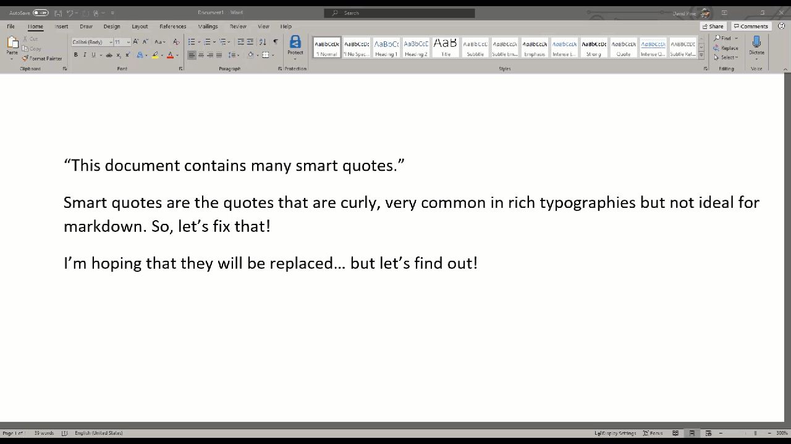

# Smart quote replacement

[!INCLUDE [markdown-extension](includes/markdown-extension.md)]

## Summary

Content developers are responsible for authoring some of the most advanced features of modern technology and intelligence, yet our tooling today prefers the usage of "dumb quotes" in Markdown. The antonym of course being "smart quotes". Smart quotes are common with ideal typographies, but not preferred with Markdown and rendered HTML.

When working on a Microsoft Word document for example, you may have noticed that when you hold the <kbd>Shift</kbd> and type a <kbd>"</kbd> Microsoft Word quickly replaces the `"` character with a smart quote equivalent `“` character.

| Description        | Unicode  | Smart Quote | Replacement |
|--------------------|----------|-------------|-------------|
| Double left quote  | `\u201c` | `“`         | `"`         |
| Double right quote | `\u201d` | `”`         | `"`         |
| Single left quote  | `\u2018` | `‘`         | `'`         |
| Single right quote | `\u2019` | `’`         | `'`         |

In a Markdown (*\*.md*) file, when you paste in text or as you update content - this feature will actively evaluate the content and automatically replace values accordingly.

> [!NOTE]
> The smart quote replacement feature also replaces other characters, such as but not limited to; (`©, ™, ®, •`, subscript and superscript characters). This is useful when pasting text from Word documents.

## Preferences

This feature is optional, but defaults to `true`. To toggle this feature on or off:

1. Select **File** > **Preferences** > **Settings** and filter by *Learn Markdown Extension*.
1. Toggle the setting in the **Markdown: Replace Smart Quotes** section.

## In action

Below is a brief demonstration of this feature.

