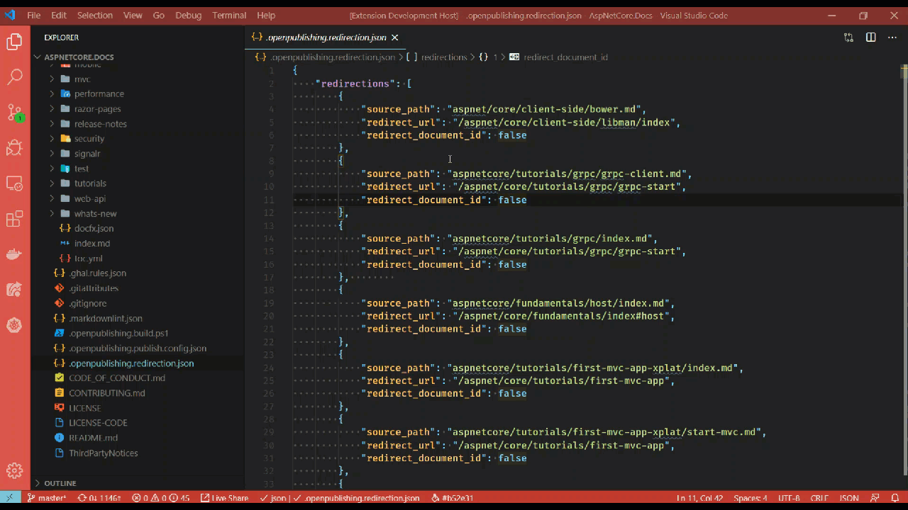

# Sort redirects

[!INCLUDE [markdown-extension](includes/markdown-extension.md)]

## Summary

With the evolution of a docset, some Markdown files eventually will be deleted. When a Markdown file is deleted, we're required to provide a redirect so that any reference to the deleted article is properly resolved via the redirect. Redirections are specified in the *.openpublishing.redirection.json* file.

1. Open the Command Palette, press <kbd>F1</kbd> (or <kbd>⇧⌘P</kbd> on macOS)
1. Type: **Learn: Sort main redirection file**
1. Select the command to execute it
1. Observe changes to *.openpublishing.redirection.json* file

## Considerations

The concept of "daisy chaining" exists with how the *.openpublishing.redirection.json* file was originally designed. Over time, files added as a redirect will eventually become stale. This happens when file A is deleted and needs a redirect to file B, then later file B is deleted and then redirects to file C. Ideally, both entries would point to C - so that A redirects to C, and B remains the same. This is a minor performance gain, and the feature is actively being worked on.

## In action

Below is a brief demonstration of this feature.

