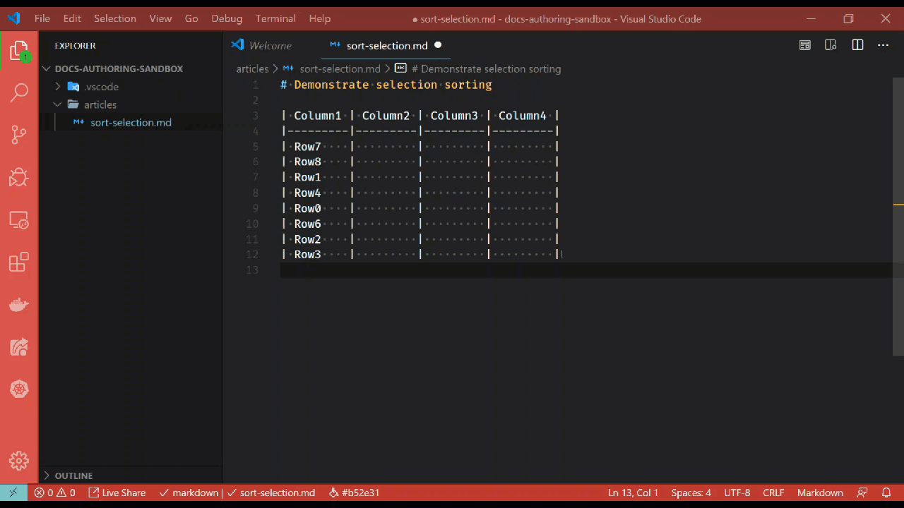

# Sort selection

[!INCLUDE [markdown-extension](includes/markdown-extension.md)]

## Summary

In a Markdown (*\*.md*) file, when you've made a selection - two sorting context menu items are now available. Right-click on the selected text to open the context menu. You will see something similar to the following menu items:

:::image type="content" source="media/sort-selection-menu.png" alt-text="Sort selection context menu":::

> [!TIP]
> The sorting context menu items are hidden until there is a valid selection in the Visual Studio Code text editor.

## Sort selection ascending (A to Z)

Selecting the **Sort selection ascending (A to Z)** option will sort the entire selection ascending, alphabetically from A to Z.

## Sort selection descending (Z to A)

Selecting the **Sort selection descending (Z to A)** option will sort the entire selection ascending, alphabetically from Z to A.

## Considerations

The underlying sorting mechanism uses *natural language* sorting. This makes it more powerful and comprehensive than standard sorting. Consider the following table:

```markdown
| Column1 | Column2                                |
|---------|----------------------------------------|
| 1       | Number 1                               |
| Aa      | The first letter in the alphabet       |
| Ab      | The first letter in the alphabet       |
| C       | The a letter after A in the alphabet   |
| M       | Somewhere in the middle?               |
| 2       | Number 2                               |
| X       | The alphabet letter is towards the end |
| Z       | The last letter in the alphabet        |
| 11      | Number 11                              |
```

Without natural language sorting, the order for `Column1` would have been 1, 11, 2, etc. but instead it understands that 11 is greater than 2 - resulting in the following ascending order:

```markdown
| Column1 | Column2                                |
|---------|----------------------------------------|
| 1       | Number 1                               |
| 2       | Number 2                               |
| 11      | Number 11                              |
| Aa      | The first letter in the alphabet       |
| Ab      | The first letter in the alphabet       |
| C       | The a letter after A in the alphabet   |
| M       | Somewhere in the middle?               |
| X       | The alphabet letter is towards the end |
| Z       | The last letter in the alphabet        |
```

## In action

Below is a brief demonstration of this feature.

[](media/sort-selection.gif#lightbox)
