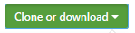
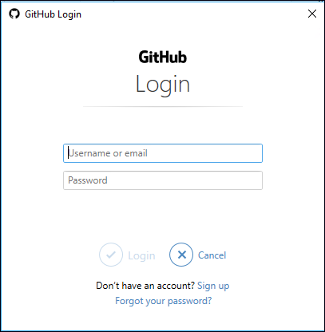

# Set up a local Git repository for documentation

This article describes the steps to set up a Git repository on your local machine, with the intent to contribute to Microsoft documentation. Contributors may use a locally cloned repository to add new articles, do major edits on existing articles, or change artwork.

You'll run these one-time setup activities to start contributing:
> [!div class="checklist"]
> * Determine the appropriate repository.
> * Fork the repository to your GitHub account.
> * Choose a local folder for the cloned files.
> * Clone the repository to your local machine.
> * Configure the upstream remote value.

> [!IMPORTANT]
> If you're making only minor changes, you *don't* need to complete the steps in this article. See [Edit in the browser](how-to-write-quick-edits.md) to learn how to make quick edits without installing any tools.
>

## Overview

To contribute to documentation on Microsoft Learn, you can make and edit Markdown files locally by cloning the corresponding documentation repository. Microsoft requires you to fork the appropriate repository into your own GitHub account so that you have read/write permissions to store your proposed changes. Then, you use pull requests (PRs) to merge changes into the read-only central shared repository.

:::image type="complex" source="media/get-started-setup-local/git-and-github-initial-setup.png" alt-text="Screenshot showing the GitHub workflow for information flowing between the upstream, origin, and local clone.":::
    The Microsoft repository is referred to as the upstream repo. Using the fork action within the GitHub user interface, the user forks the Microsoft repo into their own GitHub account. This fork is referred to as the Origin. Using git clone, the user clones the Origin to their local machine. Finally, the user uses git remote add upstream to connect their local clone back to the Microsoft upstream repo.
:::image-end:::

## Determine the repository

Documentation hosted at [Microsoft Learn](/) resides in several repositories on GitHub.

1. If you're unsure of which repository an article resides in, visit the article using your web browser. Select the **Edit** link (pencil icon) in the upper-right corner of the article.

    :::image type="content" source="media/get-started-setup-local/pencil-icon.png" alt-text="Screenshot of the pencil edit icon on a Microsoft documentation article.":::

1. This action takes you to the source file on GitHub. The repository name is displayed in the upper-left corner of the page.

    :::image type="content" source="media/get-started-setup-local/repo-name.png" alt-text="Screenshot of where the repo name is found in a GitHub repo.":::

   Here are some popular repositories that are available for public contributions:
   * Azure documentation [https://github.com/MicrosoftDocs/azure-docs](https://github.com/MicrosoftDocs/azure-docs)
   * SQL Server documentation [https://github.com/MicrosoftDocs/sql-docs](https://github.com/MicrosoftDocs/sql-docs)
   * Visual Studio documentation [https://github.com/MicrosoftDocs/visualstudio-docs](https://github.com/MicrosoftDocs/visualstudio-docs)
   * .NET Documentation [https://github.com/dotnet/docs](https://github.com/dotnet/docs)
   * Azure .Net SDK documentation [https://github.com/azure/azure-docs-sdk-dotnet](https://github.com/azure/azure-docs-sdk-dotnet)
   * ConfigMgr documentation [https://github.com/MicrosoftDocs/SCCMdocs](https://github.com/MicrosoftDocs/SCCMdocs/)

## Fork the repository

Once you've identified the correct repo, the next step is to fork the repo into your own GitHub account.

To *fork* a repository means to create a copy of it in your GitHub account. A personal fork is required because all Microsoft documentation repositories provide read-only access, but your fork gives you write access to make your changes. The fork allows you to open PRs from your fork to the Microsoft repo.

1. From the main repository's GitHub page, select the **Fork** button in the upper-right corner.

    :::image type="content" source="media/get-started-setup-local/fork.png" alt-text="Screenshot of the fork icon in the GitHub user interface.":::

2. In the **Create a new fork** screen, make sure **Owner** is set to your username and that **Copy the main branch only** is checked. Optionally, change the **Repository name** and **Description** fields.

    :::image type="content" source="media/get-started-setup-local/create-a-new-fork.png" alt-text="Screenshot of the Create a new fork screen.":::

## Clone the repository

*Clone* means create a copy of a repository on your local machine.

>[!Warning]
>
> 1. **DO NOT clone local repos into OneDrive-synced folders**. When choosing the folder into which you'll clone the repo, avoid folders that sync with OneDrive (for example, your **Documents** folder). OneDrive can cause unintended merge conflicts when you merge your changes back to the main branch. Instead, it's best to create a short filepath on your `C:\` drive (for example, _C:\\GitHub_).
>
> 2. **Git on Windows: Enable long path names**. By default, Git for Windows disables support for long filepaths, which prevents any file with a destination path longer than 255 characters from being cloned. Enable long filepaths to avoid this issue by running the following command **as an administrator**: <br/>
> `git config --global core.longpaths true`

1. Create a `GitHub` folder in your local machine. For example, _C:\GitHub_. (**Don't** clone to a OneDrive synced folder.)
1. In a browser, go to [GitHub.com](https://github.com/) and sign in.
1. In GitHub on the top right, from your profile drop-down, select **Your repositories**. The repositories page appears with a list of your forked repositories.
1. Select the repository you want to clone. The repository page of _Your_ fork appears.

   Make sure you're on the repository page for _your_ fork, **not the page for the production repo.** You can confirm that the repository you're on is your fork by checking the URL: it should show your GitHub username, not the Microsoft organization (for example, `https://github.com/nancydavolio/azure-docs` and **NOT** `https://github.com/MicrosoftDocs/azure-docs`). Also, you'll see your name in the upper-left corner, and you'll see a note that says **forked from** followed by the name of the main repository.

    :::image type="content" source="media/get-started-setup-local/forked-repo.png" alt-text="Screenshot showing a forked repo in GitHub.":::

1. Select the **\<> Code** tab at the top left of the page.
1. On the right-side, from the **Code** drop-down, copy the URL under the **HTTPS** option.

   :::image type="content" source="/media/get-started-setup-local/code-drop-down.png" alt-text="Screenshot showing how to copy the clone HTTPS URL in GitHub.":::

>[!IMPORTANT]
>You copied the clone URL via the GitHub UI. The rest of the steps should be performed in **VS Code Terminal**.

### To clone from Visual Studio Code

1. Open Visual Studio Code.
1. From top nav menu, select **View** and then select **Terminal**. The terminal view appears in the bottom of the Visual Studio Code screen. 
1. In the Terminal view, run the command to change directory (cd) to the `GitHub` folder you created for repositories on your drive in Step 1 in the Clone a repository section.

   Example:

   ```Console
    cd C:\GitHub
   ```

    If you get an error, you may have to change directory one folder at a time.

1. Run the following command to clone the repository:

    ```Console
   git clone <paste the clone URL you copied via the GitHub UI>
    ```

   For example:

   ```Console
   git clone https://github.com/nancydavolio/azure-docs.git
   ```

1. When prompted to authenticate via the browser, choose the "Sign in with your browser" button and complete the process. Be sure to download the [latest version of Git](https://git-scm.com/download/win), which supports authentication via browser functionality. If you choose to use a GitHub personal access token, you can generate one following these instructions: [Create a personal access token](https://docs.github.com/en/authentication/keeping-your-account-and-data-secure/creating-a-personal-access-token).

   The clone command downloads the repository files from your fork into a new folder in the location you chose in Step 3.

Using Git Bash, prepare to run the **clone** command to pull a copy of a repository (your fork) down to your device on the current directory. 

### Authenticate by using Git Credential Manager
If you installed the latest version of Git for Windows and accepted the default installation, Git Credential Manager is enabled by default. Git Credential Manager makes authentication much easier because you don't need to recall your personal access token when re-establishing authenticated connections and remotes with GitHub.

1. Run the **clone** command, by providing the repository name. Cloning downloads (clone) the forked repository on your local computer. 

    > [!Tip]
    > You can get your fork's GitHub URL for the clone command from the **Clone or download** button in the GitHub UI:
    >
    > 

    Be sure to specify the path to *your fork* during the cloning process, not the main repository from which you created the fork. Otherwise, you cannot contribute changes. Your fork is referenced through your personal GitHub user account, such as `github.com/<github-username>/<repo>`.

    ```bash
    git clone https://github.com/<github-username>/<repo>.git
    ```

    Your clone command should look similar to this example:

    ```bash
    git clone https://github.com/smithj/azure-docs.git
    ```

2. When you're prompted, enter your GitHub credentials.

    

3. When you're prompted, enter your two-factor authentication code.

    

    > [!Note]
    > Your credentials will be saved and used to authenticate future GitHub requests. You only need to do this authentication once per computer. 

4. The clone command runs and downloads a copy of the repository files from your fork into a new folder on the local disk. A new folder is made within the current folder. It may take a few minutes, depending on the repository size. You can explore the folder to see the structure once it is finished.

## Set up remotes

After cloning the repository, set up a read-only remote connection to the main repository named **upstream**. You use the upstream URL to keep your local repository in sync with the latest changes made by others. The **git remote** command is used to set the configuration value. You use the **fetch** command to refresh the branch info from the upstream repository.

1. If you're using **Git Credential Manager**, use the following commands. Replace the \<repo\> and \<organization\> placeholders.
   ```bash
   cd <repo>
   git remote add upstream https://github.com/<organization>/<repo>.git
   git fetch upstream
   ```

2. View the configured values and confirm the URLs are correct. Ensure the **origin** URLs point to your personal fork. Ensure the **upstream** URLs point to the main repository, such as MicrosoftDocs or Azure. 
   ```bash
   git remote -v 
   ```

   Example remote output is shown. A fictitious git account named MyGitAccount is configured with a personal access token to access the repo azure-docs:
   ```output
   origin  https://github.com/MyGitAccount/azure-docs.git (fetch)
   origin  https://github.com/MyGitAccount/azure-docs.git(push)
   upstream        https://github.com/MicrosoftDocs/azure-docs.git (fetch)
   upstream        https://github.com/MicrosoftDocs/azure-docs.git (push)
   ```

3. If you made a mistake, you can remove the remote value. To remove the upstream value, run the command `git remote remove upstream`.

## Next steps

- To learn more about adding and updating content, continue to the [Make major changes](how-to-write-major-edits.md).
