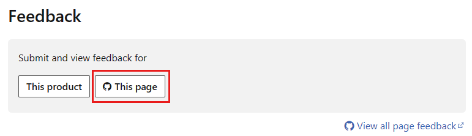

# Create GitHub issues for open-source products

This article teaches you how to create a GitHub issue for Microsoft Learn documentation related to open-source products. It also teaches you how to peruse other users' issues and either add your own comments to them or open a pull request (PR) to address them.

Our open-source product documentation is a continuous work in progress. Receiving good GitHub issues from contributors helps us focus our efforts on the highest priorities for the community.

Of course, if you know how to fix an issue, we invite you to [make the changes yourself](how-to-write-quick-edits.md), instead of opening an issue.

> [!NOTE]
> Only open-source products using the open-source feedback experience accept GitHub issues. For more information and a list of participating repositories, see [Use the open-source experience](provide-feedback.md#use-the-open-source-experience). To learn about how to provide non-GitHub feedback across the Microsoft Learn platform, see [Provide feedback on Microsoft Learn](provide-feedback.md).

## Prerequisites

- [Create a GitHub account](index.md#create-a-github-account), if you don't have one.

## Create an issue

1. Navigate to the article you want to comment on.
1. Scroll to the bottom of the article, where you'll see options for submitting feedback. Select **Open a documentation issue** to create a new issue. This feedback is specific to the content and is tracked as an issue in GitHub.

    

    Optionally, select **Provide product feedback** to go to a destination (for example, a feedback portal, GitHub, an email address) where you can provide feedback on the product itself. This feedback is independent of the content and has no relationship back to the original article.

1. The system opens a new issue for you in the GitHub repository that stores the content for the article you're viewing. Add a title and a description; all other fields should populate for you automatically. When you're done, select **Submit new issue**.

    :::image type="content" source="media/how-to-create-github-issues/github-issue.png" alt-text="Screenshot of the new-issue form in GitHub.":::

    The more detail you provide, the more helpful the issue is. Tell us what information you sought or the search terms you used to get to this article. If you can't get started, tell us how you want to start exploring unfamiliar technology. You can also add screenshots or files to help us understand your issue.

That's it! Your issue is now added to the Issues queue. Issues start the conversation about what's needed. The content team will respond to these issues with ideas for what we can add and ask for your opinions.

## Comment on an issue

You can comment on any issue in a repository that supports GitHub issues. You can also add your own comments to an issue you've created.

1. Find the issue you want to comment on. In your browser, navigate to the GitHub repository you want to look at issues for. Choose the **Issues** tab to see the open issues for that repo. If the repo has a lot of issues, use the **Filters** bar to filter by label, author, and more. Or use the **Search** bar to look for specific queries. Once you find an issue that appeals to you, select it to open it.

    Only open-source products using the open-source feedback experience accept GitHub issues. For more information and a list of participating repositories, see [Use the open-source experience](provide-feedback.md#use-the-open-source-experience).

1. Read the issue and any comments that have already been added by others. If you want to add a comment, scroll to the bottom of the issue and enter your comment in the **Leave a comment** box. When you're done, select **Comment**.

    :::image type="content" source="media/how-to-create-github-issues/comment-issue.png" alt-text="Screenshot of a GitHub issue with a comment box at the bottom.":::

## Open a pull request to address issues

As you browse issues, you may find one that you know how to fix. If so, you're welcome to open a PR to address the issue. For more information, see [Edit documentation in the browser](how-to-write-quick-edits.md).

Once you've opened a PR to address the issue, return to the issue and add a comment that links to your PR. This helps us track the issue and the PR together. Use the pound sign (#) followed by the PR number to link to the PR. For example, if your PR number is 4210, you'd enter `#4210` in your comment.

:::image type="content" source="media/how-to-create-github-issues/pr-open-issue.png" alt-text="Screenshot of the GitHub issue comment box with a link to a PR.":::
