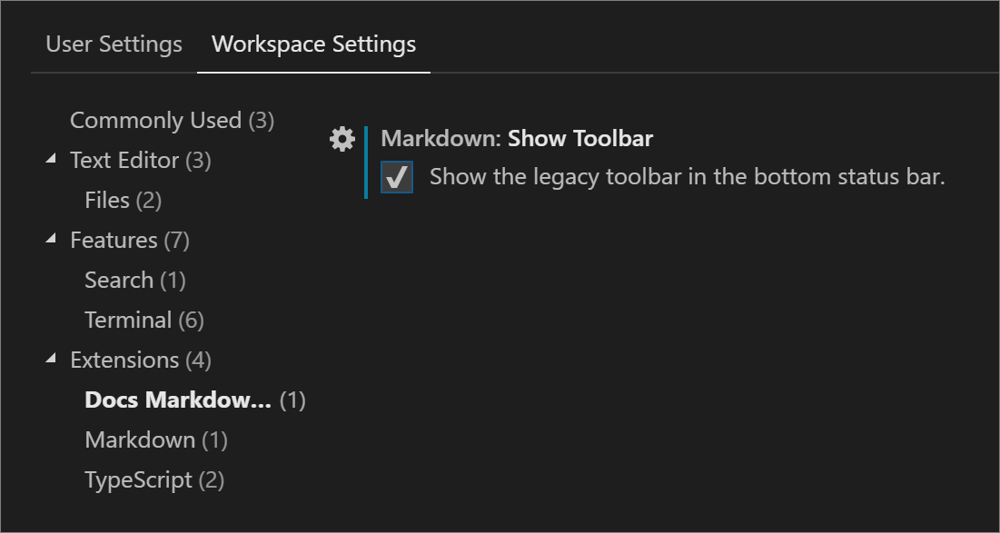

# Learn Authoring Pack for Visual Studio Code

The Learn Authoring Pack is a collection of Visual Studio Code extensions to aid with Markdown authoring for Microsoft Learn content. The pack is [available in the VS Code Marketplace](https://marketplace.visualstudio.com/items?itemName=docsmsft.docs-authoring-pack) and contains the following extensions:

> [!div class="checklist"]
>
> - [Learn Markdown](https://marketplace.visualstudio.com/items?itemName=docsmsft.docs-markdown): Provides Markdown authoring assistance for content on Microsoft Learn, including support for basic Markdown syntax as well as custom Markdown syntax like alerts, code snippets, and non-localizable text. Now also includes some basic YAML authoring assistance, such as inserting TOC entries.
> - [markdownlint](https://marketplace.visualstudio.com/items?itemName=DavidAnson.vscode-markdownlint): A popular Markdown linter by David Anson to help make sure your Markdown is valid.
> - [Code Spell Checker](https://marketplace.visualstudio.com/items?itemName=streetsidesoftware.code-spell-checker): A fully offline spell checker by Street Side Software.
> - [Learn Preview](https://marketplace.visualstudio.com/items?itemName=docsmsft.docs-preview): Uses the Microsoft Learn CSS for more accurate Markdown preview, including custom Markdown.
> - [Learn Article Templates](https://marketplace.visualstudio.com/items?itemName=docsmsft.docs-article-templates): Allows users to scaffold Learn modules and apply Markdown skeleton content to new files.
> - [Learn YAML](https://marketplace.visualstudio.com/items?itemName=docsmsft.docs-yaml): Provides YAML schema validation and auto-complete.
> - [Learn Images](https://marketplace.visualstudio.com/items?itemName=docsmsft.docs-images): Provides image compression and resizing for folders and individual files to help authors of Microsoft Learn content.

## Prerequisites and assumptions

To insert relative links, images, and other embedded content with the Learn Markdown extension, you must have your VS Code workspace scoped to the root of your cloned Open Publishing System (OPS) repo. For example, if you have cloned the docs repository to `C:\git\SomeDocsRepo\`, then open that folder or a subfolder in VS Code: **File** > **Open Folder** menu,  or `code C:\git\SomeDocsRepo\` from the command line.

Some syntax supported by the extension, such as alerts and snippets, are custom Markdown for OPS. Custom Markdown will not render correctly unless published via OPS.

## How to use the Learn Markdown extension

To access the **Learn Markdown** menu, type <kbd>Alt</kbd>+<kbd>M</kbd>. You can click or use the up and down arrows to select the command you want. Or you can type to start filtering, then hit <kbd>ENTER</kbd> when the function you want is highlighted in the menu.

See the [Learn Markdown readme](https://marketplace.visualstudio.com/items?itemName=docsmsft.docs-markdown) for an up-to-date list of commands.

## How to generate a main redirect file

The Learn Markdown extension includes a script to generate or update a main redirection file for a repo, based on the `redirect_url` metadata in individual files. This script checks every Markdown file in the repo for `redirect_url`, adds the redirection metadata to the main redirection file (_.openpublishing.redirection.json_) for the repo, and moves the redirected files to a folder outside the repo. To run the script:

1. Select <kbd>F1</kbd> to open the VS Code command palette.
2. Start typing "Learn: Generate..."
3. Select the command `Learn: Generate main redirection file`.
4. When the script finishes running, the redirection results will show in the VS Code output pane, and the removed Markdown files will be added to the Learn Authoring\redirects folder under your default path.
5. Review the results. If they are as expected, submit a pull request to update the repo.

## How to assign keyboard shortcuts

1. Type <kbd>Ctrl</kbd>+<kbd>K</kbd> then <kbd>Ctrl</kbd>+<kbd>S</kbd> to open the **Keyboard Shortcuts** list.
1. Search for the command, such as `formatBold`, for which you want to create a custom key binding.
1. Click the plus that appears near the command name when you mouse over the line.
1. After a new input box is visible, type the keyboard shortcut you want to bind to that particular command. For example, to use the common shortcut for bold, type <kbd>Ctrl</kbd>+<kbd>B</kbd>.
1. It's a good idea to insert a `when` clause into your key binding, so it won't be available in files other than Markdown. To do this, open _keybindings.json_ and insert the following line below the command name (be sure to add a comma between lines):

    ```json
    "when": "editorTextFocus && editorLangId == 'markdown'"
    ```

    Your completed custom key binding should look like this in _keybindings.json_:

    ```json
    [
        {
            "key": "ctrl+b",
            "command": "formatBold",
            "when": "editorTextFocus && editorLangId == 'markdown'"
        }
    ]
    ```

    > [!TIP]
    > Place your key bindings in this file to overwrite the defaults

1. Save _keybindings.json_.

For more information on key bindings, see the [VS Code docs](https://code.visualstudio.com/docs/getstarted/keybindings).

## How to show the legacy "Gauntlet" toolbar

Former users of the extension code-named "Gauntlet" will notice that the authoring toolbar no longer appears at the bottom of the VS Code window when the Learn Markdown Extension is installed. This is because the toolbar took up a large space on the VS Code status bar and did not follow best practices for extension UX, so it is deprecated in the new extension. However, you can optionally show the toolbar by updating your VS Code settings.json file as follows:

1. In VS Code, go to **File** > **Preferences** > **Settings** or select <kbd>Ctrl</kbd>+<kbd>,</kbd>.
1. Select **User Settings** to change the settings for all VS Code workspaces or **Workspace Settings** to change them for just the current workspace.
1. Select **Extensions** > **Learn Markdown Extension Configuration**, and then select **Show the legacy toolbar in the bottom status bar**.

   

Once you've made your selection, VS Code updates the _settings.json_ file. You will then be prompted to reload the window for the changes to take effect.

Newer commands added to the extension will not be available from the toolbar.

## How to use Learn templates

The Learn Article Templates extension lets writers in VS Code pull a Markdown template from a centralized store and apply it to a file. Templates can help ensure that required metadata is included in articles, that content standards are followed, and so on. Templates are managed as Markdown files in a public GitHub repository.

### To apply a template in VS Code

1. Ensure the Learn Article Templates extension is installed and enabled.
1. If you don't have the Learn Markdown extension installed, click <kbd>F1</kbd> to open the command palette, start typing "template" to filter, then click `Learn: Template`. If you do have Learn Markdown installed, you can use either the command palette or click <kbd>Alt</kbd>+<kbd>M</kbd> to bring up the Learn Markdown QuickPick menu, then select `Template` from the list.
1. Select the desired template from the list that appears.

### To add your GitHub ID and/or Microsoft alias to your VS Code settings

The Templates extension supports three dynamic metadata fields: author, ms.author, and ms.date. That means that if a template creator uses these fields in the metadata header of a Markdown template, they will be auto-populated in your file when you apply the template, as follows:

| Metadata field | Value |
|--|--|
| `author` | Your GitHub alias, if specified in your VS Code settings file. |
| `ms.author` | Your Microsoft alias, if specified in your VS Code settings file. If you are not a Microsoft employee, leave unspecified. |
| `ms.date` | The current date in the supported format, `MM/DD/YYYY`. The date is not automatically updated if you subsequently update the file - you must update it manually. This field is used to indicate the "article freshness". |

### To set author and/or ms.author

1. In VS Code, go to **File** > **Preferences** > **Settings** or select <kbd>Ctrl</kbd>+<kbd>,</kbd>.
1. Select **User** settings to change the settings for all VS Code workspaces, or **Workspace** settings to change them for just the current workspace.
1. In the Default Settings pane on the left, find **Learn Article Templates Extension Configuration**, click the pencil icon next to the desired setting, then click Replace in Settings.
1. The **User** settings pane will open side by side, with a new entry at the bottom.
1. Add your GitHub ID or Microsoft email alias, as appropriate, and save the file.
1. You might need to close and restart VS Code for the changes to take effect.
1. Now, when you apply a template that uses dynamic fields, your GitHub ID and/or Microsoft alias will be auto-populated in the metadata header.

### To make a new template available in VS Code

1. Draft your template as a Markdown file.
1. Submit a pull request to the templates folder of the [MicrosoftDocs/content-templates](https://github.com/MicrosoftDocs/content-templates) repo.

The content team will review your template and merge the PR if it meets the style guidelines. Once merged, the template will be available to all users of the Learn Article Templates extension.

## Demo several features

Here's a short video that demonstrates the following features of the Learn Authoring Pack:

- **YAML files**
  - Support for "Learn: Link to file in repo"
- **Markdown files**
  - Update "ms.date" Metadata Value context menu option
  - Code auto-completion support for code-fence language identifiers
  - Unrecognized code-fence language identifier warnings / auto correction support
  - Sort selection ascending (A to Z)
  - Sort selection descending (Z to A)

> [!VIDEO https://www.youtube.com/embed/6zfbBRdjlw8]

## Next steps

Explore the various features available in the Learn Authoring Pack, Visual Studio Code extension.

- [Dev lang completion](docs-authoring/dev-lang-completion.md)
- [Image compression](docs-authoring/image-compression.md)
- [Metadata updates](docs-authoring/metadata-updates.md)
- [Reformat table](docs-authoring/reformat-table.md)
- [Smart quote replacement](docs-authoring/smart-quote-replacement.md)
- [Sort redirects](docs-authoring/sort-redirects.md)
- [Sort selection](docs-authoring/sort-selection.md)
