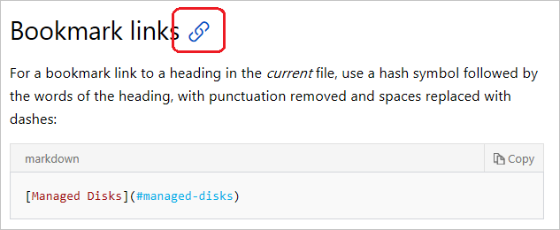
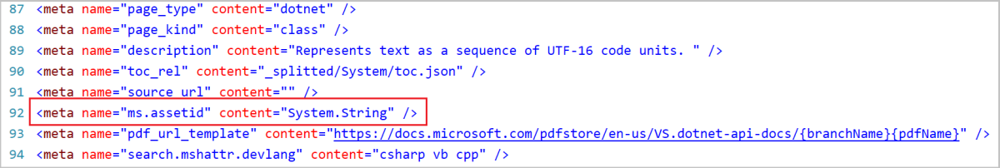

# Use links in documentation

This article describes how to use hyperlinks from pages hosted at Microsoft Learn. Links are easy to add into markdown with a few varying conventions. Links point users to content in the same page, in other neighboring pages, or on external sites and URLs.

The Microsoft Learn backend uses Open Publishing Services (OPS), which supports [CommonMark][]-compliant markdown parsed through the [Markdig][] parsing engine. This markdown flavor is mostly compatible with [GitHub Flavored Markdown (GFM)][GFM], as most docs are stored in GitHub and can be edited there. Additional functionality is added through Markdown extensions.

> [!IMPORTANT]
> All links must be secure (`https` vs `http`) whenever the target supports it (which the vast majority should).

## Link text

The words that you include in link text should be friendly. In other words, they should be normal English words or the title of the page that you're linking to.

> [!IMPORTANT]
> Do not use "click here" as link text. It's bad for search engine optimization and doesn't adequately describe the target.

**Correct:**

- `For more information, see the [contributor guide index](https://github.com/Azure/azure-content/blob/master/contributor-guide/contributor-guide-index.md).`

- `For more details, see the [SET TRANSACTION ISOLATION LEVEL](/sql/t-sql/statements/set-transaction-isolation-level-transact-sql) reference.`

**Incorrect:**

- `For more details, see [https://msdn.microsoft.com/library/ms173763.aspx](https://msdn.microsoft.com/library/ms173763.aspx).`

- `For more information, click [here](https://github.com/Azure/azure-content/blob/master/contributor-guide/contributor-guide-index.md).`

## Links from one article to another

There are two types of hyperlinks supported by the publishing system: **URLs** and **file links**.

A URL link can be a URL path that is relative to the root of `https://learn.microsoft.com`, or an absolute URL that includes the full URL syntax (for example, `https://github.com/MicrosoftDocs/PowerShell-Docs`).

- Use URL links when linking to content outside of the current _docset_ or between autogenerated reference and conceptual articles within the docset.
- The simplest way to create a relative link is to copy the URL from your browser, then remove `https://learn.microsoft.com/en-us` from the value you paste into markdown.
- Do not include locales in URLs for Microsoft properties (for example, remove `/en-us` from the URL).

A file link is used to link from one article to another within the docset.

- All file paths use forward-slash (`/`) characters instead of back-slash characters.
- An article links to another article in the same directory:

  `[link text](article-name.md)`

- An article links to an article in the parent directory of the current directory:

  `[link text](../article-name.md)`

- An article links to an article in a subdirectory of the current directory:

  `[link text](directory/article-name.md)`

- An article links to an article in a subdirectory of the parent directory of the current directory:

  `[link text](../directory/article-name.md)`

- Some articles consist of both a `.yml` and `.md` file, where the `.yml` file contains metadata and the `.md` contains the content. In that case, link to the `.yml` file:

  `[link text](../directory/article-name.yml)` (_not_ `[link text](../directory/article-name-content.md)`)

> [!NOTE]
> None of the previous examples use the `~/` as part of the link. To link to an absolute path that begins at the root of the repository, start the link with `/`. Including the `~/` produces invalid links when navigating the source repositories on GitHub. Starting the path with `/` resolves correctly.

### Structure of links on Microsoft Learn

Content published on Microsoft Learn has the following URL structure:

`https://learn.microsoft.com/<locale>/<product-service>/[<feature-service>]/[<subfolder>]/<topic>[?view=<view-name>]`

Examples:

```
https://learn.microsoft.com/azure/load-balancer/load-balancer-overview

https://learn.microsoft.com/powershell/azure/overview?view=azurermps-5.1.1
```

- `<locale>` - identifies the language of the article (example: en-us or de-de)
- `<product-service>` - the name of the product or service (example: powershell, dotnet, or azure)
- `[<feature-service>]` - (optional) the name of the product's feature or subservice (example: csharp or load-balancer)
- `[<subfolder>]` - (optional) the name of a subfolder within a feature
- `<topic>` - the name of the article file for the topic (example: load-balancer-overview or overview)
- `[?view=\<view-name>]` - (optional) the view name used by the version selector for content that has multiple versions available (example: azps-3.5.0)

> [!TIP]
> In most cases, articles in the same _docset_ have the same `<product-service>` URL fragment. For example:
>
> - Same docset:
>   - `https://learn.microsoft.com/dotnet/core/get-started`
>   - `https://learn.microsoft.com/dotnet/framework/install`
> - Different docset:
>   - `https://learn.microsoft.com/dotnet/core/get-started`
>   - `https://learn.microsoft.com/visualstudio/whats-new`

## Bookmark links

For a bookmark link to a heading in the *current* file, use a hash symbol followed by the lowercase words of the heading. Remove punctuation from the heading and replace spaces with dashes:

```markdown
[Managed Disks](#managed-disks)
```

To link to a bookmark heading in another article, use the file-relative or site-relative link plus a hash symbol, followed by the words of the heading. Remove punctuation from the heading and replace spaces with dashes:

```markdown
[Managed Disks](../../linux/overview.md#managed-disks)
```

You can also copy the bookmark link from the URL. To find the URL, hover your mouse over the heading line on Microsoft Learn. You should see a link icon appear:



Click the link icon and then copy the bookmark anchor text from the URL (that is, the part after the hash).

> [!NOTE]
> The Learn Markdown extension also has tools to help create links.

### Explicit anchor links

Adding explicit anchor links using the `<a>` HTML tag isn't required or recommended, except in hub and landing pages. Instead, use the auto-generated bookmarks as described in [bookmark links](#bookmark-links). For hub and landing pages, declare anchors as follows:

```markdown
## <a id="anchortext" />Header text
```

or

```markdown
## <a name="anchortext" />Header text
```

And the following to link to the anchor:

```markdown
To go to a section on the same page:
[text](#anchortext)

To go to a section on another page.
[text](filename.md#anchortext)
```

> [!NOTE]
> Anchor text must always be lowercase and not contain spaces.

## XRef (cross reference) links

XRef links are the recommended way to link to APIs, because they're validated at build time. To link to auto-generated API reference pages in the current docset or other docsets, use XRef links with the unique ID ([UID](#determine-the-uid)) of the type or member.

> [!TIP]
> You can use the [Learn Markdown extension for VS Code][docsextension] (part of the Learn Authoring Pack) to insert .NET XRref links that are surfaced in the [.NET API Browser][].

Check if the API you want to link to is published on [Microsoft Learn](/) by typing all or some of its full name in the [.NET API browser][] or [Windows UWP][] search box. If you don't see any results displayed, the type isn't yet on Microsoft Learn.

You can use one of the following syntaxes:

- Auto-links:

   ```markdown
   <xref:UID>
   <xref:UID?displayProperty=nameWithType>
   ```

   By default, link text shows only the member or type name. The optional `displayProperty=nameWithType` query parameter produces fully qualified link text, that is, **namespace.type** for types, and **type.member** for type members, including enumeration type members.

- Markdown-style links:

   ```markdown
   [link text](xref:UID)
   ```

   Use Markdown-style links for XRef when you want to customize the link text that's displayed.

Examples:

- **\<xref:System.String>** displays as <xref:System.String>

- **\<xref:System.String?displayProperty=nameWithType>** displays as
  <xref:System.String?displayProperty=nameWithType>

- **\[String class](xref:System.String)** displays as [String class](xref:System.String).

The `displayProperty=fullName` query parameter works the same way as `displayProperty=nameWithType` for classes. That is, the link text becomes **namespace.classname**. However, for members, the link text displays as **namespace.classname.membername**, which may be undesirable.

> [!NOTE]
> UIDs are case sensitive. For example, `<xref:System.Object>` resolves correctly but `<xref:system.object>` does not.

### XRef build warnings and incremental builds

An incremental build only builds files that have changed or been affected by a change. If you see a build warning about an invalid XREF link, but the link is actually valid, this could be because the build was incremental. The file causing the warning didn't change, so it wasn't built and past warnings were replayed. The warning will disappear when the file changes or if you trigger a full build (you can start a full build on ops.microsoft.com). This is a drawback to incremental builds, because DocFX can't detect a data update inside the XREF service.

### Determine the UID

The UID is usually the fully qualified class or member name. There are at least two ways to determine the UID:

- Right-click on the [Microsoft Learn](/) page for a type or member, select **View source**, and then copy the **content** value for **ms.assetid**:

  

- Use the [autocomplete site][] by appending some or all of the name of the type to the URL. For example, entering `https://xref.docs.microsoft.com/autocomplete?text=Writeline` in the address bar of your browser displays all the types and methods that contain **Writeline** in their name, along with their UID.

#### Verify the UID

To test if you have the correct UID, replace **System.String** in the following URL with your UID, and then paste it into the address bar of a browser:

`https://xref.docs.microsoft.com/query?uid=System.String`

> [!TIP]
> The UID in the URL is case-sensitive, and if you're checking a method overload UID, don't include spaces between the parameter types.

If you see something like the following, you have the correct UID:

```text
[{"uid":"System.String","name":"String","fullName":"System.String","href":"https://learn.microsoft.com/dotnet/api/system.string","tags":",/dotnet,netframework-4.5.1,netframework-4.5.2,netframework-4.5,...xamarinmac-3.0,public,","vendor":null,"hash":null,"commentId":"T:System.String","nameWithType":"System.String"},{"uid":"System.String","name":"String","fullName":"System.String","href":"https://learn.microsoft.com/dotnet/api/system.string","tags":",/dotnet,netframework-4.5.1,netframework-4.5.2,netframework-4.5,netframework-4.6,netframework-4.6.1,...,xamarinmac-3.0,public,","vendor":null,"hash":null,"commentId":"T:System.String","nameWithType":"System.String"}]
```

If you just see `[]` displayed on the page, you have the wrong UID.

### Percent-encoding of URLs

Special characters in the UID need to be HTML encoded as follows:

| Character | HTML encoding |
| --------- | ------------- |
| `` ` ``   | %60           |
| `#`       | %23           |
| `*`       | %2A           |

See a full list of [percent-codes](https://en.wikipedia.org/wiki/Percent-encoding).

Encoding examples:

- ``System.Threading.Tasks.Task`1`` encodes as `System.Threading.Tasks.Task%601` (see the [section on generic types](#generic-types))

- `System.Exception.#ctor` encodes as `System.Exception.%23ctor`

- `System.Object.Equals*` encodes as `System.Object.Equals%2A`

### Generic types

Generic types are those types such as `System.Collections.Generic.List<T>`. If you browse to this type in the [.NET API browser](/dotnet/api/) and look at its URL, you see that `<T>` is written as `-1` in the URL, which actually represents **`1**:

`https://learn.microsoft.com/dotnet/api/system.collections.generic.list-1`

To link to a generic type such as **List\<T>**, encode the **\`** backtick character as **%60**, as
shown in the following example:

```markdown
<xref:System.Collections.Generic.List%601>
```

### Methods

To link to a method, you can either link to the general method page by adding an asterisk (`*`) after the method name, or to a specific overload. For example, use the general page when you want to link to the `<xref:System.Object.Equals%2A?displayProperty=nameWithType>` method without specific parameter types. The asterisk character is encoded as `%2A`. For example:

`<xref:System.Object.Equals%2a?displayProperty=nameWithType>` links to <xref:System.Object.Equals%2A?displayProperty=nameWithType>

To link to a specific overload, add parenthesis after the method name and include the full type name of each parameter. Do not put a space character between the type names or the link won't work. For example:

`<xref:System.Object.Equals(System.Object,System.Object)?displayProperty=nameWithType>` links to <xref:System.Object.Equals(System.Object,System.Object)?displayProperty=nameWithType>

## Links from includes

Because include files are located in another directory, you must use longer relative paths. To link to an article from an include file, use this format:

```markdown
[link text](../articles/folder/article-name.md)
```

> [!TIP]
> The [Learn Authoring Pack](https://marketplace.visualstudio.com/items?itemName=docsmsft.docs-authoring-pack) extension for Visual Studio Code helps you insert relative links and bookmarks correctly without the tedium of figuring out paths.

## Links in selectors

A selector is a navigation component that appears in a docs article as a drop-down list. When a reader selects a value in the drop-down, the browser opens the selected article. Typically the selector list contains links to closely related articles, for example the same subject matter in multiple programming languages or a closely related series of articles.

If you have selectors that are embedded in an include, use the following link structure:

   ```markdown
   > [AZURE.SELECTOR-LIST (Dropdown1 | Dropdown2 )]
   - [(Text1 | Example1 )](../articles/folder/article-name1.md)
   - [(Text1 | Example2 )](../articles/folder/article-name2.md)
   - [(Text2 | Example3 )](../articles/folder/article-name3.md)
   - [(Text2 | Example4 )](../articles/folder/article-name4.md)
   ```

## Reference-style links

You can use reference-style links to make your source content easier to read. Reference-style links replace inline link syntax with simplified syntax that allows you to move the long URLs to the end of the article. Here's [Daring Fireball](https://daringfireball.net/projects/markdown/) 's example:

Inline text:

   ```markdown
   I get 10 times more traffic from [Google][1] than from [Yahoo][2] or [MSN][3].
   ```

Link references at the end of the article:

   ```markdown
   <!--Reference links in article-->
   [1]: http://google.com/
   [2]: http://search.yahoo.com/
   [3]: http://search.msn.com/
   ```

Make sure that you include the space after the colon, before the link. When you link to other technical articles, if you forget to include the space, the link will be broken in the published article.

## Links to pages that are not part of the technical documentation set

To link to a page on another Microsoft property (such as a pricing page, SLA page, or anything else that is not a documentation article), use an absolute URL, but omit the locale. The goal here is that links work in GitHub and on the rendered site:

   ```markdown
   [link text](https://azure.microsoft.com/pricing/details/virtual-machines/)
   ```

## Links to third-party sites

The best user experience minimizes sending users to another site. So base any links to third-party sites, which we do sometimes need, on this info:

- **Accountability**: Link to third-party content when it's the third-party's information to share. For example, it's not Microsoft's place to tell people how to use Android developer tools--that is Google's story to tell. If we need to, we can explain how to use Android developer tools *with* Azure, but Google should tell the story of how to use their tools.
- **PM signoff**: Request that Microsoft sign off on third-party content. By linking to it, we are saying something about our trust in it and our obligation if people follow the instructions.
- **Freshness reviews**: Make sure that the third-party info is still current, correct, and relevant, and that the link hasn't changed.
- **Offsite**: Make users aware that they are going to another site. If the context does not make that clear, add a qualifying phrase. For example: "Prerequisites include the Android Developer Tools, which you can download on the Android Studio site."
- **Next steps**: It's fine to add a link to, say, an MVP blog in a "Next steps" section. Again, just make sure that users understand they'll be leaving the site.
- **Legal**: We are covered legally under **Links to Third Party Sites** in the **Terms of Use** footer on every microsoft.com page.

<!-- link references -->
[CommonMark]: https://commonmark.org/
[Markdig]: https://github.com/lunet-io/markdig
[GFM]: https://help.github.com/categories/writing-on-github/
[.NET API browser]: /dotnet/api/
[Windows UWP]: /uwp/api
[docsextension]: https://marketplace.visualstudio.com/items?itemName=docsmsft.docs-markdown
[autocomplete site]: https://xref.docs.microsoft.com/autocomplete?text=
