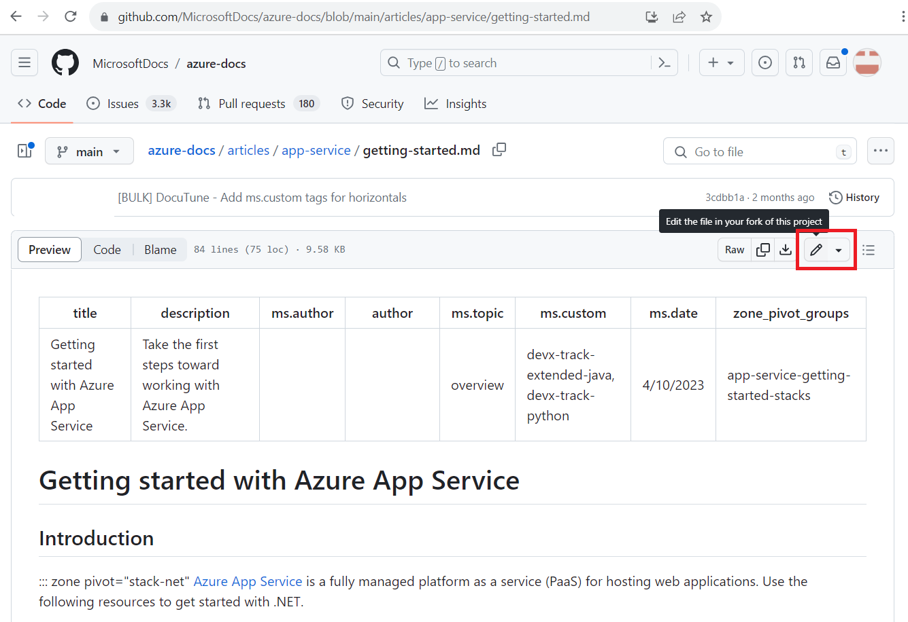
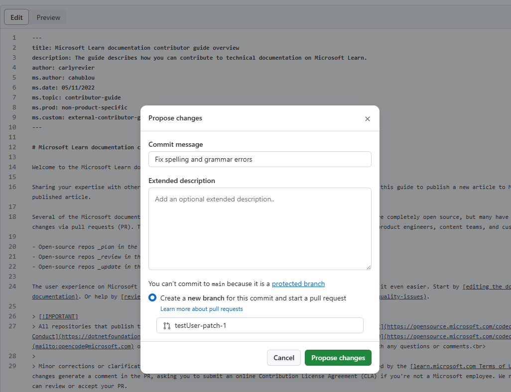
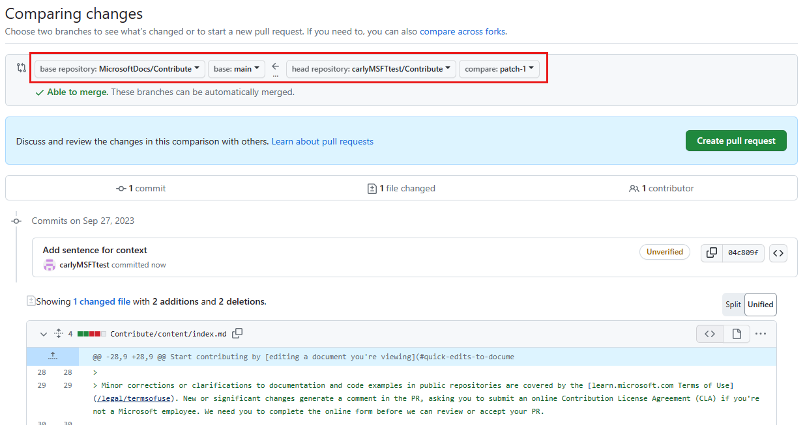
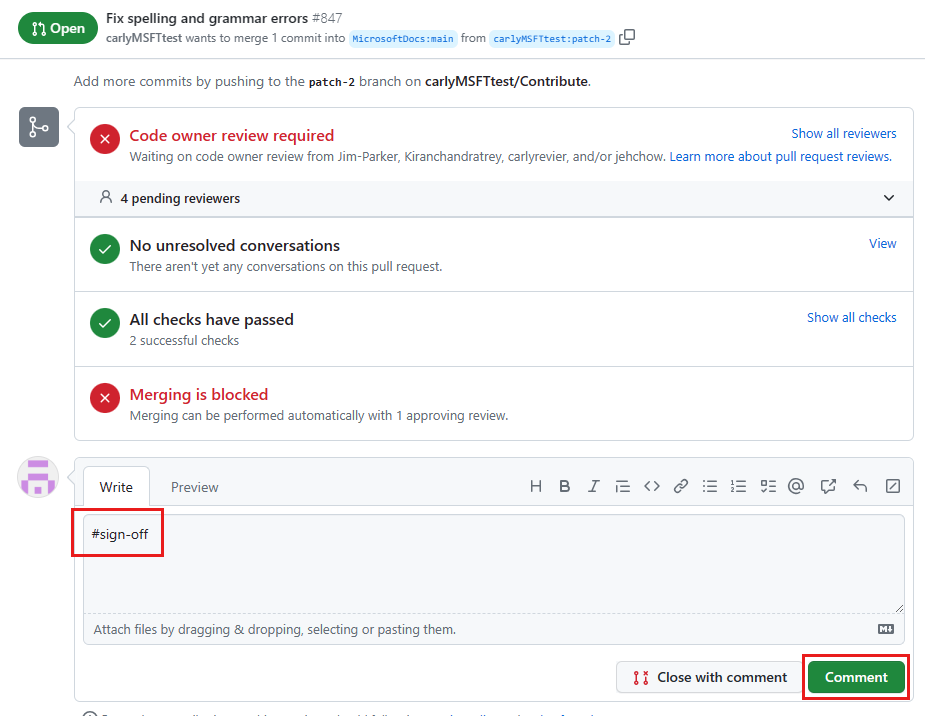

# Edit Microsoft Learn Documentation in the Browser

Microsoft's documentation sets are often open source and hosted on GitHub. While not all sets are entirely open source, many have public-facing repositories where contributions via pull requests (PRs) are welcome. This open-source approach greatly aids communication between product engineers, content teams, and customers.

Quick edits streamline reporting and fixing small errors or omissions in documentation. Despite our best efforts, minor grammar and spelling issues _can_ slip into published documents. While creating issues to report mistakes is an option, using a PR to rectify issues, when available, is faster and more efficient.

All changes, even from contributors with write access, are made through PRs. Most repositories protect the default branch, necessitating updates to be submitted as PRs.

## Prerequisites

- [Create a GitHub account](index.md#create-a-github-account) if you haven't already.

## Editing a Document in the Browser

1. Navigate to the documentation you intend to edit. _Some_ docs pages allow direct content editing in the browser. Look for the **Edit** pencil icon, as shown below. Clicking this icon takes you to the source file on GitHub.

   

   If the **Edit** button isn't visible, it means the content isn't open to public contributions. Some pages, such as those generated from inline code documentation, require edits within their respective projects.

1. Click the pencil icon at the top of the GitHub file page. If the icon appears grayed out or isn't displayed, log in to your GitHub account.

   

   At the top of the article is its metadata, applied for reporting, discoverability via search, and site experience. Minor updates to published articles often don't necessitate metadata changes.

1. If it's your first time in this repository, you'll likely be prompted to fork the repo before proposing changes. Select **Fork this repository** to proceed.

1. Edit the file using the web editor. Use the **Preview** tab in the toolbar to check your changes' formatting.

1. After completing your edits, select the **Commit changes** or **Propose changes** button, typically located at the top-right of the screen.

   

1. Enter a commit message, which becomes the PR title, summarizing your changes (e.g., "Fix spelling and grammar errors"). Optionally, provide an **Extended description** for more details. Then, select **Propose changes**.

1. Having proposed and committed your changes, you'll need the repository owners to "pull" them into their repository using a [pull request](https://docs.github.com/articles/using-pull-requests)(PR). Upon selecting **Propose changes**, you'll encounter a page similar to this:

   

   Your PR suggests changes from your fork and branch (on the right side) into the documentation repo's main fork and `main` branch (on the left side). Review your changes and then select **Create pull request**.

1. On the **Open a pull request** page, preview your PR. Modify the title or description if necessary. When ready, select **Create pull request** to initiate your PR.

1. If satisfied and finished with edits, add a comment reading `#sign-off`. This informs the PR review team that your PR is ready for review.

    

1. That's it! The content team will review your PR and merge it upon approval. You might receive feedback requesting changes.

## Limitations

- Most localized (i.e., translated) documentation doesn't allow editing or feedback via GitHub. To provide feedback on localized content, use the [Provide Feedback](https://aka.ms/provide-feedback) form.
- The in-browser editing suits minor, infrequent changes. For substantial contributions or advanced Git features (e.g., branch management, complex merge conflict resolution), consider [forking the repo and working locally](how-to-write-workflows-major.md).
