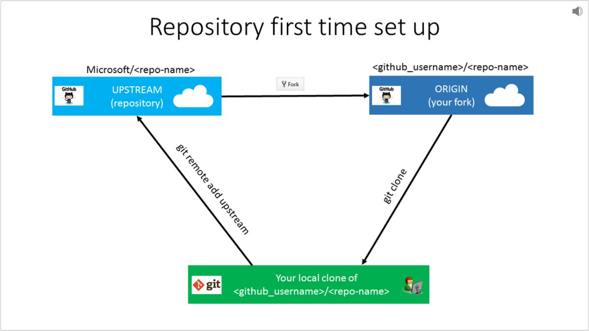

# Set up Git repository locally for documentation

This article describes the steps to set up a git repository on your local machine, with the intent to contribute to Microsoft documentation. Contributors may use a locally cloned repository to add new articles, do major edits on existing articles, or change artwork.

You run these one-time setup activities to get started contributing:
> [!div class="checklist"]
> * Determine the appropriate repository
> * Fork the repository to your GitHub account
> * Choose a local folder for the cloned files
> * Clone the repository to your local machine
> * Configure the upstream remote value

> [!IMPORTANT]
> If you're making only minor changes to an article, you *do not* need to complete the steps in this article. You can continue directly to the [quick changes workflow](index.md#quick-edits-to-existing-documents).
>

## Overview

To contribute to Microsoft's documentation site, you can make and edit Markdown files locally by cloning the corresponding documentation repository. Microsoft requires you to fork the appropriate repository into your own github account, so that you have read/write permissions there to store your proposed changes. Then you use pull requests to merge changes into the read-only central shared repository.



If you're new to GitHub, watch the following video for a conceptual overview of the forking and cloning process:

>[!VIDEO https://channel9.msdn.com/Blogs/CoolMoose/Git-Repository-Setup/player]

## Determine the repository

Documentation hosted at [docs.microsoft.com](https://docs.microsoft.com) resides in several different repositories at [github.com](https://www.github.com).

1. If you are unsure of which repository to use, then visit the article on docs.microsoft.com using your web browser. Select the **Edit** link (pencil icon) on the upper right of the article.

   

2. That link takes you to github.com location for the corresponding Markdown file in the appropriate repository. Note the URL to view the repository name.

   

   For example, these popular repositories are available for public contributions:
   - Azure documentation [https://github.com/MicrosoftDocs/azure-docs](https://github.com/MicrosoftDocs/azure-docs)
   - SQL Server documentation [https://github.com/MicrosoftDocs/sql-docs](https://github.com/MicrosoftDocs/sql-docs)
   - Visual Studio documentation [https://github.com/MicrosoftDocs/visualstudio-docs](https://github.com/MicrosoftDocs/visualstudio-docs)
   - .NET Documentation [https://github.com/dotnet/docs](https://github.com/dotnet/docs)
   - Azure .Net SDK documentation [https://github.com/azure/azure-docs-sdk-dotnet](https://github.com/azure/azure-docs-sdk-dotnet)

## Fork the repository
Using the appropriate repository, create a fork of the repository into your own GitHub account by using the GitHub website.

A personal fork is required since all main documentation repositories provide read-only access. To make changes, you must submit a [pull request](git-github-fundamentals.md#pull-requests) from your fork into the main repository. To facilitate this process, you first need your own copy of the repository, in which you have write access. A GitHub *fork* serves that purpose.

1. Go to the main repository's GitHub page and click the **Fork** button on the upper right.

   

2. If you are prompted, select your GitHub account tile as the destination where the fork should be created. This prompt creates a copy of the repository within your GitHub account, known as a fork.

## Choose a local folder
Make a local folder to hold a copy of the repository locally. Some of the repositories can be large; up to 5 GB for azure-docs for example. Choose a location with available disk space.

1. Choose a folder name should be easy for you to remember and type. For example, consider a root folder `C:\docs\` or make a folder in your user profile directory `~/Documents/docs/`

   > [!IMPORTANT]
   > Avoid choosing a local folder path that is nested inside of another git repository folder location. While it is acceptable to store the git cloned folders adjacent to each other, nesting git folders inside one another causes errors for the file tracking.

2. Launch Git Bash

   

   The default location that Git Bash starts in is typically the home directory (~) or `/c/users/<Windows-user-account>/` on Windows OS.

   To determine the current directory, type `pwd` at the $ prompt. 

3. Change directory (cd) into the folder that you created for hosting the repository locally. Note that Git Bash uses the Linux convention of forward-slashes instead of back-slashes for folder paths.

   For example, `cd /c/docs/ ` or `cd ~/Documents/docs/`

## Create a local clone

Using Git Bash, prepare to run the **clone** command to pull a copy of a repository (your fork) down to your device on the current directory. 

### Authenticate by using Git Credential Manager
If you installed the latest version of Git for Windows and accepted the default installation, Git Credential Manager is enabled by default. Git Credential Manager makes authentication much easier, because you don't need to recall your personal access token when re-establishing authenticated connections and remotes with GitHub.

1. Run the **clone** command, by providing the repository name. Cloning downloads (clone) the forked repository on your local computer. 

    > [!Tip]
    > You can get your fork's GitHub URL for the clone command from the **Clone or download** button in the GitHub UI:
    >
    > 

    Be sure to specify the path to *your fork* during the cloning process, not the main repository from which you created the fork. Otherwise, you cannot contribute changes. Your fork is referenced through your personal GitHub user account, such as `github.com/<github-username>/<repo>`.

    ```bash
    git clone https://github.com/<github-username>/<repo>.git
    ```

    Your clone command should look similar to this example:

    ```bash
    git clone https://github.com/smithj/azure-docs.git
    ```

2. When you're prompted, enter your GitHub credentials.

    

3. When you're prompted, enter your two-factor authentication code.

    

    > [!Note]
    > Your credentials will be saved and used to authenticate future GitHub requests. You only need to do this authentication once per computer. 

4. The clone command runs and downloads a copy of the repository files from your fork into a new folder on the local disk. A new folder is made within the current folder. It may take a few minutes, depending on the repository size. You can explore the folder to see the structure once it is finished.

## Configure remote upstream
After cloning the repository, set up a read-only remote connection to the main repository named **upstream**. You use the upstream URL to keep your local repository in sync with the latest changes made by others. The **git remote** command is used to set the configuration value. You use the **fetch** command to refresh the branch info from the upstream repository.

1. If you're using **Git Credential Manager**, use the following commands. Replace the \<repo\> and \<organization\> placeholders.
   ```bash
   cd <repo>
   git remote add upstream https://github.com/<organization>/<repo>.git
   git fetch upstream
   ```

2. View the configured values and confirm the URLs are correct. Ensure the **origin** URLs point to your personal fork. Ensure the **upstream** URLs point to the main repository, such as MicrosoftDocs or Azure. 
   ```bash
   git remote -v 
   ```

   Example remote output is shown. A fictitious git account named MyGitAccount is configured with a personal access token to access the repo azure-docs:
   ```output
   origin  https://github.com/MyGitAccount/azure-docs.git (fetch)
   origin  https://github.com/MyGitAccount/azure-docs.git(push)
   upstream        https://github.com/MicrosoftDocs/azure-docs.git (fetch)
   upstream        https://github.com/MicrosoftDocs/azure-docs.git (push)
   ```

3. If you made a mistake, you can remove the remote value. To remove the upstream value, run the command `git remote remove upstream`.

## Next steps
- To learn more about adding and updating content, continue to the [GitHub contribution workflow](how-to-write-workflows-major.md).
