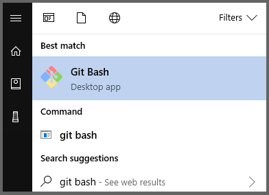

# Set up a local Git repository

This article describes the steps to set up a Git repository on your local machine, with the intent to contribute to Microsoft documentation. Contributors may use a locally cloned repository to add new articles, do major edits on existing articles, or change artwork.

You run these one-time setup activities to start contributing:

> [!div class="checklist"]
> * Determine the repository
> * Fork the repository to your GitHub account
> * Choose a local folder for the cloned files
> * Clone the repository to your local machine
> * Configure the upstream remote value

> [!IMPORTANT]
> If you're making only minor changes to an article, you *do not* need to complete the steps in this article. You can continue directly to the [quick changes workflow](index.md#quick-edits-to-documentation).

## Overview

To contribute to Microsoft's documentation you must fork the appropriate repository into your own GitHub account. A fork provides an isolated space allowing you to have read/write permissions for your proposed changes. You can make and edit files locally by cloning your fork. Once your changes are complete, you use pull requests to merge changes into the Microsoft documentation repository.

:::image type="content" source="media/contribute-get-started-setup-local/repository-initial-setup.png" alt-text="Diagram showing the repository's initial setup." lightbox="media/contribute-get-started-setup-local/repository-initial-setup.svg":::

## Determine the repository

Documentation hosted at [docs.microsoft.com](https://docs.microsoft.com) resides in several different repositories on [GitHub](https://github.com).

1. If you are unsure of which repository to use, then visit the article on [docs.microsoft.com](https://docs.microsoft.com) using your web browser. Select the **Edit** link (pencil icon) at the upper right of the article.

   :::image type="content" source="media/index/edit-article.png" alt-text="Select Edit to determine the repository and file location.":::

   If the **Edit** button isn't present, it may mean the content isn't open to public contributions.

2. The **Edit** link takes you to the GitHub location for the corresponding Markdown file in the appropriate repository. GitHub displays the repository name at the top left of the page.

   :::image type="content" source="media/contribute-get-started-setup-local/public-repo.png" alt-text="The repository name is listed at the top left of the GitHub page.":::

   For example, these popular repositories are available for public contributions:
   * Azure Documentation [https://github.com/MicrosoftDocs/azure-docs](https://github.com/MicrosoftDocs/azure-docs)
   * SQL Server Documentation [https://github.com/MicrosoftDocs/sql-docs](https://github.com/MicrosoftDocs/sql-docs)
   * Visual Studio Documentation [https://github.com/MicrosoftDocs/visualstudio-docs](https://github.com/MicrosoftDocs/visualstudio-docs)
   * .NET Documentation [https://github.com/dotnet/docs](https://github.com/dotnet/docs)
   * Azure .NET SDK Documentation [https://github.com/azure/azure-docs-sdk-dotnet](https://github.com/azure/azure-docs-sdk-dotnet)
   * Microsoft Endpoint Configuration Manager Documentation [https://github.com/MicrosoftDocs/memdocs](https://github.com/MicrosoftDocs/memdocs)

## Fork the repository

Use the GitHub website to create a fork of the the appropriate repository. The newly created fork will be held in your GitHub account and changes are isolated from the main Microsoft repository.

A personal fork is required since all main documentation repositories provide read-only access. To make changes, you must submit a [pull request](git-github-fundamentals.md#pull-requests) from your fork into the main repository. To facilitate this process, you first need your own copy of the repository, in which you have write access. A GitHub *fork* serves that purpose.

1. Go to the repository's GitHub page and select the **Fork** button at the upper right.

   :::image type="content" source="media/contribute-get-started-setup-local/fork-location.png" alt-text="Select Fork at the upper right of the repository on GitHub.":::

2. You will be taken to a page for creating a new fork. The fork destination should be automatically set to your GitHub account. If you belong to multiple organizations you will be able to change the destination account, choose the account that fits best. Generally the default settings work fine, but feel free to customize the provided fields. Once you are satisfied with your selections, select **Create fork**.

    :::image type="content" source="media/contribute-get-started-setup-local/create-fork.png" alt-text="Create a new fork page.":::

    A copy of the Microsoft repository will be created within the account you selected, this is known as a fork.

## Choose a local folder

Make a local folder to hold a copy of the repository locally. Some of the repositories can be large; up to 5 GB for azure-docs for example. Choose a location with available disk space.

1. Choose a folder name should be easy for you to remember and type. For example, consider a root folder `C:\docs\` or make a folder in your user profile directory `~/Documents/docs/`

   > [!IMPORTANT]
   > Avoid choosing a local folder path that is nested inside of another git repository folder location. While it is acceptable to store the git cloned folders adjacent to each other, nesting git folders inside one another causes errors for the file tracking.

2. Launch Git Bash

   

   The default location that Git Bash starts in is typically the home directory (~) or `/c/users/<Windows-user-account>/` on Windows.

   To determine the current directory, type `pwd` at the $ prompt.

3. Change directory (cd) into the folder that you created for hosting the repository locally. Note that Git Bash uses the Linux convention of forward-slashes instead of back-slashes for folder paths.

   For example, `cd /c/docs/` or `cd ~/Documents/docs/`

## Create a local clone

Using Git Bash, prepare to run the **clone** command to pull a copy of a repository (your fork) down to your device on the current directory.

### Authenticate by using Git Credential Manager

If you installed the latest version of Git for Windows and accepted the default installation, Git Credential Manager is enabled by default. Git Credential Manager makes authentication much easier because you don't need to recall your personal access token when re-establishing authenticated connections and remotes with GitHub.

1. Run the **clone** command, by providing the repository name. Cloning downloads (clone) the forked repository on your local computer.

    > [!Tip]
    > You can get your fork's GitHub URL for the clone command from the **Clone or download** button in the GitHub UI:
    >
    > 

    Be sure to specify the path to *your fork* during the cloning process, not the main repository from which you created the fork. Otherwise, you cannot contribute changes. Your fork is referenced through your personal GitHub user account, such as `github.com/<github-username>/<repo>`.

    ```bash
    git clone https://github.com/<github-username>/<repo>.git
    ```

    Your clone command should look similar to this example:

    ```bash
    git clone https://github.com/smithj/azure-docs.git
    ```

2. When you're prompted, enter your GitHub credentials.

    

3. When you're prompted, enter your two-factor authentication code.

    

    > [!Note]
    > Your credentials will be saved and used to authenticate future GitHub requests. You only need to do this authentication once per computer. 

4. The clone command runs and downloads a copy of the repository files from your fork into a new folder on the local disk. A new folder is made within the current folder. It may take a few minutes, depending on the repository size. You can explore the folder to see the structure once it is finished.

## Configure remote upstream

After cloning the repository, set up a read-only remote connection to the main repository named **upstream**. You use the upstream URL to keep your local repository in sync with the latest changes made by others. The **git remote** command is used to set the configuration value. You use the **fetch** command to refresh the branch info from the upstream repository.

1. If you're using **Git Credential Manager**, use the following commands. Replace the \<repo\> and \<organization\> placeholders.

   ```bash
   cd <repo>
   git remote add upstream https://github.com/<organization>/<repo>.git
   git fetch upstream
   ```

2. View the configured values and confirm the URLs are correct. Ensure the **origin** URLs point to your personal fork. Ensure the **upstream** URLs point to the main repository, such as MicrosoftDocs or Azure. 

   ```bash
   git remote -v 
   ```

   Example remote output is shown. A fictitious git account named MyGitAccount is configured with a personal access token to access the repo azure-docs:

   ```output
   origin  https://github.com/MyGitAccount/azure-docs.git (fetch)
   origin  https://github.com/MyGitAccount/azure-docs.git(push)
   upstream        https://github.com/MicrosoftDocs/azure-docs.git (fetch)
   upstream        https://github.com/MicrosoftDocs/azure-docs.git (push)
   ```

3. If you made a mistake, you can remove the remote value. To remove the upstream value, run the command `git remote remove upstream`.

## Next steps

In this step you set up your local Git repository and learned how to contribute to documentation. In the next step you will learn more about adding and updating content.

> [!div class="nextstepaction"]
> [GitHub contribution workflow](how-to-write-workflows-major.md)
