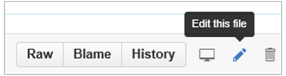
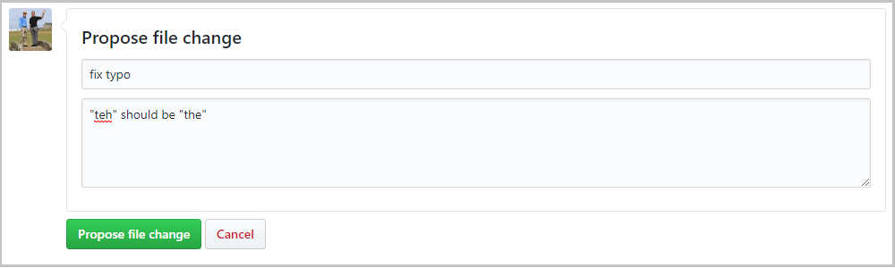
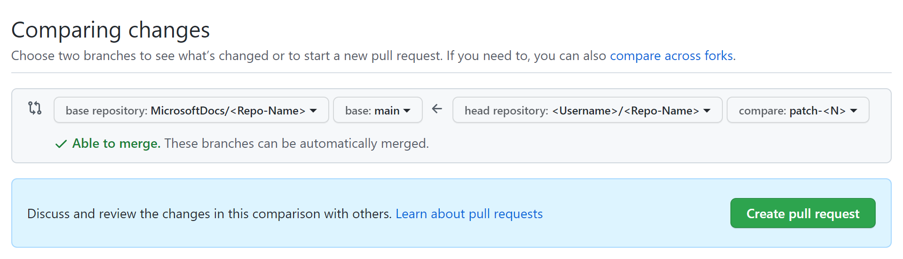

# Microsoft Docs contributor guide overview

Welcome to the [docs.microsoft.com](https://docs.microsoft.com) (Docs) Contributor Guide!

Several of our documentation sets are open source, hosted on GitHub. More teams at Microsoft are adopting this model all the time. Even document sets that are not completely open source have public-facing repos where you are invited to make pull requests. It streamlines and improves communication between the product engineers, the content teams, and our customers. Working in the open provides several advantages:

- Open source repos plan in the open to get feedback on what docs are most needed.
- Open source repos review in the open to publish the most helpful content on our first release.
- Open source repos update in the open to make it easier to continuously improve the content.

The user experience on [docs.microsoft.com](https://docs.microsoft.com) integrates [GitHub](https://github.com) workflows directly to make it even easier. Start by [editing the document you are viewing](#quick-edits-to-existing-documents). Or, help by [reviewing new topics](#review-open-prs), or [create quality issues](#create-quality-issues).

> [!IMPORTANT]
> All repositories that publish to docs.microsoft.com have adopted the [Microsoft Open Source Code of Conduct](https://opensource.microsoft.com/codeofconduct/) or the [.NET Foundation Code of Conduct](https://dotnetfoundation.org/code-of-conduct). For more information, see the [Code of Conduct FAQ](https://opensource.microsoft.com/codeofconduct/faq/). Or contact [opencode@microsoft.com](mailto:opencode@microsoft.com), or [conduct@dotnetfoundation.org](mailto:conduct@dotnetfoundation.org) with any questions or comments. 
>
> Minor corrections or clarifications to documentation and code examples in public repositories are covered by the [docs.microsoft.com Terms of Use](https://docs.microsoft.com/legal/termsofuse). New or significant changes generate a comment in the pull request, asking you to submit an online Contribution License Agreement (CLA) if you are not an employee of Microsoft. We need you to complete the online form before we can review or accept your pull request.

## Quick edits to existing documents

Quick edits streamline the process to report and fix small errors and omissions in documents. Despite all efforts, small grammar and spelling errors do make their way into our published documents. While you can create issues to report mistakes, it's faster and easier to create a pull request (PR) to fix the issue. Almost every article displays an edit button as shown in the following figure. Clicking the **Edit** button takes you to the source file on GitHub.

Next, click the pencil icon, shown in the following figure to edit the article.

> [!NOTE]
> If the pencil icon is grayed out, you need to login to your GitHub account, or create a new account. Make your changes in the web editor. You can click the **Preview changes** tab to check formatting of your change.

Once you have made your changes, scroll to the bottom of the page. Enter a title and description for your PR and click **Propose file change** as shown in the following figure:

Now that you've proposed your change, you need to ask the owners of the repository to "pull" your changes into their repository. This is done using something called a "pull request". When you clicked on **Propose file change** in the figure above, you should have been taken to a new page that looks like the following figure:

Click **Create pull request**, enter a title (and optionally a description) for the pull request, and then click **Create pull request** again.

That's it! Content team members will review and merge your PR. You may get some feedback requesting changes if you made larger changes.

The GitHub editing UI responds to your permissions on the repository. The preceding images are accurate for contributors that do not have write permissions to the target repository. GitHub automatically creates a fork of the target repository in your account. If you have write access to the target repository, GitHub creates a new branch in the target repo. The branch name has the form **\<GitHubId\>-patch-n** using your GitHub ID, and a numeric identifier for the patch branch.

We use PRs for all changes, even for contributors that have write access. Most repositories have the `master` branch protected so that updates must be submitted as PRs.

The in-browser editing experience is best for minor or infrequent changes. If you make large contributions, or use advanced Git features (such as branch management or advanced merge conflict resolution), you need to [fork the repo and work locally](how-to-write-workflows-major.md).

## Review open PRs

You can read new topics before they are published by checking the currently open PRs. Reviews follow the [GitHub flow](https://guides.github.com/introduction/flow/) process. You can see proposed updates or new articles in public repositories. Review them and add your comments. Look at any of our docs repositories, and check the open pull requests (PRs) for areas that interest you. Community feedback on proposed updates helps the entire community.

## Create quality issues

Our docs are a continuous work in progress. Good issues help us focus our efforts on the highest priorities for the community. The more detail you can provide, the more helpful the issue. Tell us what information you sought. Tell us the search terms you used. If you can't get started, tell us how you want to start exploring unfamiliar technology.

Issues start the conversation about what's needed. The content team will respond to these issues with ideas for what we can add, and ask for your opinions. When we create a draft, we'll ask you to [review the PR](#review-open-prs).

## Get more involved

Other topics help you get started productively contributing to Microsoft Docs. They explain working with GitHub repositories, Markdown tools, and extensions used in the Microsoft Docs platform.
