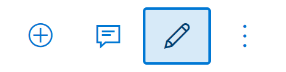
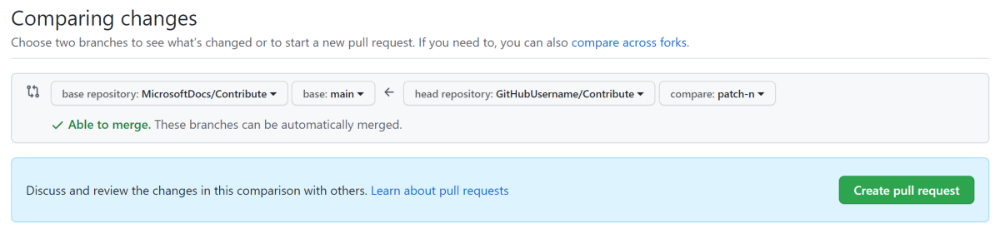

# Довідник співавторів документаціі Майкрософт

Ласкаво просимо до довідника співатора [docs.microsoft.com](https://docs.microsoft.com) (Docs)!

Деяка документація компанії Майкрософт надається з відкритим кодом та розміщується на GitHub. Не вся документація надається з повним відкритим кодом, але багато документів розміщені в публічних репозиторіях де є можливість вносити правки за допомогою запиту на внесення змін. Даний підхід до відкритого коду дозволяє пришвидшити та покращити комунікацію між розробниками продуктів, командами які відповідають за наповнення вмісту та клієнтами, а також має додаткові переваги:  

- Можливість  _відкритого планування_ вмісту репозиторіїв з відкритим кодом дозволяє отримувати відгуки та визначати  найнеобхідніші документи.
- Можливість _відкритого огляду_ вмісту репозиторіїв з відкритим кодом дозволяє публікацію найкориснішого вмісту під час першого випуску.
- Можливість _відкритого оновлення_ вмісту репозиторіїв з відкритим кодом спрощує безперервне вдосконалення опублікованого вмісту.

Користувацький інтерфейс сайту [docs.microsoft.com](https://docs.microsoft.com) безпосередньо інтегрує робочі процеси [GitHub](https://github.com), роблячи їх використання ще більш зручним. Почніть з [редагування документа, який ви переглядаєте](#швидке-редагування-існуючих-документів). Крім того ви можете допомогти [переглядаючи нові розділи](#перегляд-відкритих-запитів-на-внесення-змін), чи [створюючи звіти про проблеми з якістю](#створюйте-проблеми-з-якістю).  

> [!Важливо]
> Усі репозиторії, які публікують до docs.microsoft.com, прийняли [Кодекс поведінки з відкритим кодом Microsoft](https://opensource.microsoft.com/codeofconduct/) або [Кодекс поведінки .NET Foundation](https://dotnetfoundation.org/code-of-conduct). Для отримання додаткової інформації дивіться [Поширені запитання щодо Кодексу поведінки](https://opensource.microsoft.com/codeofconduct/faq/). Або зв’яжіться з [opencode@microsoft.com](mailto:opencode@microsoft.com) або [conduct@dotnetfoundation.org](mailto:conduct@dotnetfoundation.org) із будь-якими запитаннями чи коментарями.
>
>Незначні виправлення або уточнення до документації та прикладів коду в загальнодоступних репозиторіях охоплюються [Умовами використання docs.microsoft.com](https://docs.microsoft.com/legal/termsofuse). Нові або суттєві зміни генерують коментар у запиті на внесення змін з проханням подати он-лайн згоду з ліцензією Contribution License Agreement (CLA), якщо ви не є співробітником Microsoft. Нам потрібно, щоб ви заповнили онлайн-форму, перш ніж ми зможемо переглянути або прийняти ваш запит на внесення змін.

## Швидке редагування існуючих документів

Швидкі редагування впорядковують процес звітування та виправлення невеликих помилок та упущень в документах. Незважаючи на всі зусилля, невеликі граматичні та орфографічні помилки _потрапляють_ у наші опубліковані документи. Хоча ви можете створювати проблеми для повідомлення про помилки, але швидше і простіше створити запит на внесення змін (PR), щоб виправити проблему, коли така опція доступна.

1. Деякі сторінки документів дозволяють редагувати вміст безпосередньо у браузері. Якщо це так, то ви побачите кнопку **Редагувати**, як показано нижче. Натискання кнопки **Редагувати** (або еквівалентну назву відповідно до налаштувань локалізації) переходить до вихідного файлу на GitHub. Якщо кнопка Редагувати (піктограма олівця без тексту) відсутня, це означає, що сторінка документації недоступна для зміни.

   

2. Далі натисніть значок олівця, щоб відредагувати статтю, як показано нижче. Якщо піктограма олівця неактивна, вам потрібно або увійти у свій обліковий запис GitHub, або створити новий.

   

3. Внесіть зміни у веб-редакторі. Клацніть на вкладку **Попередній перегляд**, щоб перевірити форматування внесених змін.

4. Після внесення змін прокрутіть сторінку до кінця. Введіть заголовок та опис змін та натисніть **Запропонувати зміну файлу**, як показано на наступному малюнку:

   

5. Тепер, коли ви запропонували свою зміну, вам потрібно попросити власників репозиторію "внести" ваші зміни до свого репозиторію. Це робиться за допомогою процесу, який має назву "запит на внесення змін". Коли ви натиснули на **Запропонувати зміну файлу** на малюнку вище, ви повинні були потрапити на нову сторінку, яка виглядає так, як показано на малюнку:

   

   Клацніть **Створити запит на внесення змін**, введіть заголовок (і, за бажанням, опис) запиту на внесення змін, а потім знову натисніть **Створити запит на внесення змін**. (Якщо ви новачок у GitHub, див. [Докладніше про запити на внесення змін](https://help.github.com/en/articles/about-pull-requests).)  

6. Ось і все! Учасники команди відповідальної за вміст розглянуть і об’єднають ваш запит не внесення змін (PR). Якщо ви внесли великі зміни, ви можете отримати відгук із проханням внести деякі додаткові зміни.

Інтерфейс редагування GitHub відповідає вашим правам доступу на сховище. Попередні зображення є точні для співавторів, які не мають прав на запис у цільовий репозиторій. GitHub автоматично створює відгалуження цільового репозиторію у вашому обліковому записі. Якщо у вас є доступ на запис до цільового сховища, GitHub створює нову гілку в репозиторії. Ім'я гілки має вигляд **\<GitHubId> -patch-n**, використовуючи ваш GitHub ID, та числовий ідентифікатор гілки виправлення.

Ми використовуємо запити на внесення змін для всіх змін, навіть для співавторів, які мають  права доступу на запис. У більшості репозиторіїв `головна гілка` є захищеною, тому оновлення потрібно подавати як запити на внесення змін.

Редагування у веб-переглядачі найкраще підходить для незначних або нечастих змін. Якщо ви робите значний внесок або використовуєте розширені функції Git (наприклад, управління гілками або розширене вирішення конфліктів злиття), вам потрібно [відгалузити репозиторій та працювати локально](how-to-write-workflows-major.md).

> [!ПРИМІТКА]
> Якщо увімкнено, ви можете редагувати статтю **будь-якою мовою**, і, залежно від типу редагування, відбуватиметься наступне:

> 1. будь-які лінгвістичні зміни, які будуть затверджені, також допоможуть вдосконалити наш механізм Машинного Перекладу.
> 2. будь-яке редагування, яке суттєво змінює зміст статті, буде оброблятися внутрішньо, для подання змін до тієї самої статті англійською мовою, щоб вона могла бути локалізованою на всі мови після затвердження.
> Пропоновані вами вдосконалення не лише позитивно вплинуть на статті вашою рідною мовою, але й усіма доступними мовами.

## Перегляд відкритих запитів на внесення змін

Ви можете прочитати нові теми до їх публікації, перевіривши відкриті запити на внесення змін. Перегляд проводиться з  дотриманням [GitHub flow](https://guides.github.com/introduction/flow/) процесу. Ви можете бачити запропоновані оновлення або нові статті в загальнодоступних репозиторіях. Перегляньте їх та додайте свої коментарі. Перегляньте будь-які з наших репозиторіїв з документами та перевірте відкриті запити на внесення змін для областей, які вас цікавлять. Відгуки спільноти на рахунок запропонованих оновлень допомагають всій спільноті.

## Створюйте "проблеми з якістю"

Наші документи - це безперервна робота. Хороші проблеми (з якістю) допомагають нам зосередити свої зусилля на найвищих пріоритетах для громади. Чим більше деталей ви можете надати, тим кориснішою буде "проблема"( з якістю). Розкажіть, яку інформацію ви шукали. Розкажіть пошукові терміни, які ви використували. Якщо вам не вдається розпочати роботу, розкажіть нам, як ви хочете почати вивчати незнайомі технології.

Багато сторінок документації корпорації Майкрософт мають розділ **Зворотній зв'язок** внизу сторінки, де Ви можете натиснути та **залишити відгук про товар** чи **залишити відгук про вміст**, щоб відстежувати проблеми, характерні для цієї статті.

Проблеми починають розмову про те, що є необхідним. Команда відповідальна за вміст дасть відповідь на ці проблеми ідеями щодо того, що ми можемо додати, і запитає вашу думку. Коли ми створюємо чорновий варіант, ми просимо вас [переглянути запит на внесення змін.](#перегляд-відкритих-запитів-на-внесення-змін)

## Дізнатись більше

Інші теми допомагають розпочати продуктивно робити свій внесок у Документи Microsoft. Вони пояснюють роботу з репозиторіями GitHub, інструментами Markdown та розширеннями, що використовуються на платформі Microsoft Docs.
