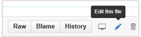

# GitHub contribution workflow for minor or infrequent changes

> [!IMPORTANT]
> All repositories that publish to docs.microsoft.com have adopted either the [Microsoft Open Source Code of Conduct](https://opensource.microsoft.com/codeofconduct/) or the [.NET Foundation Code of Conduct](https://dotnetfoundation.org/code-of-conduct). For more information, see the [Code of Conduct FAQ](https://opensource.microsoft.com/codeofconduct/faq/). Or contact [opencode@microsoft.com](mailto:opencode@microsoft.com), or [conduct@dotnetfoundation.org](mailto:conduct@dotnetfoundation.org) with any questions or comments. 
>
> Minor corrections or clarifications to documentation and code examples in public repositories are covered by the [docs.microsoft.com Terms of Use](https://docs.microsoft.com/legal/termsofuse). New or significant changes will generate a comment in the pull request, asking you to submit an online Contribution License Agreement (CLA) if you are not an employee of Microsoft. We need you to complete the online form before we can accept your pull request.

## Overview

This workflow is suitable for making minor or infrequent changes, by using GitHub's web-based Markdown editor. The GitHub editor is limited in terms of what you can do, because the UI does not support all Git operations and authoring scenarios. If you need to make large contributions, or you need support for advanced Git features (such as branch management or advanced merge conflict resolution), refer to the [major or long-running changes workflow](full-workflow.md).

## Procedure for using the GitHub editor to propose your changes

1. Browse to the article's corresponding GitHub repository and Markdown file. You can use either of the following methods:

   - Find the article by browsing through the Markdown files in the related GitHub repository.
   - Go to the article on [docs.microsoft.com](https://docs.microsoft.com/) and select the **Edit** link in the upper-right corner of the page.

     

2. Select the **Edit this file** pencil icon to go into edit mode:

    

3. Make changes by using Markdown on the **Edit file** tab, and preview your changes on the **Preview changes** tab. Using the editor is fairly straightforward, but if you need assistance, see the following guides:

   - [How to use Markdown](how-to-write-use-markdown.md)
   - [Creating files on GitHub](https://github.com/blog/1327-creating-files-on-github)
   - [Upload files to your repositories](https://github.com/blog/2105-upload-files-to-your-repositories)

4. Scroll to the bottom of the page, where you see one of the following:

   - **Propose file change**: Appears when you have read-only access to the repository, such as [editing files in another user's repository](https://help.github.com/articles/editing-files-in-another-user-s-repository/). In this case, GitHub will create a "patch" branch in your fork of the repository (and automatically create a fork if it doesn't exist). After you select **Propose file change**, a **Comparing changes** page appears so you can verify your changes. Then select the **Create pull request** button to submit your changes to the pull request queue, and proceed to the [next section](#pull-request-processing).

   - **Commit changes**: Appears when you have write permissions to a repository, such as [editing files in your own repository](https://help.github.com/articles/editing-files-in-your-repository/). In this case, GitHub gives you two options for saving your changes:

     - **Commit directly to the `<branch-name>` branch**, where `<branch-name>` is the name of the branch that you were on when you selected the **Edit** button. This applies your changes directly to the branch instead of using a pull request. At this point, you're finished!

     - **Create a new branch for this commit and start a pull request**, which prompts you with a default name to create a new branch. After you select **Propose file change**, a **Comparing changes** page appears so you can verify your changes. Then select the **Create pull request** button to submit your changes to the pull request queue, and proceed to the [next section](#pull-request-processing).

[!INCLUDE[contribute-how-to-write-workflows-pull-request-processing](includes/contribute-how-to-write-workflows-pull-request-processing.md)]

## Next steps

- Continue to the "Writing essentials" articles to learn more about Markdown, Markdown extensions syntax, and more.
