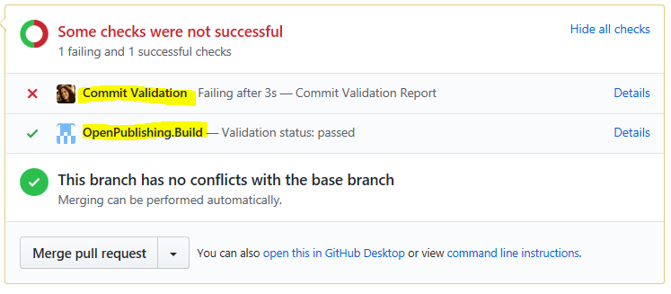
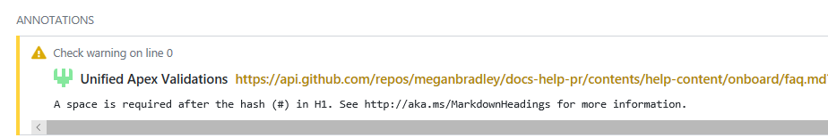

# Docs PR validation service

The Docs PR validation service is a GitHub app that runs validation rules on the files in a PR.

When the validation service is enabled on a repo, you'll see the following behavior:

1. You submit a PR.
1. In the GitHub comment that indicates the status of your PR, you'll see the status of "checks" enabled on the repo. Note that in this example, there are two checks enabled, "Commit Validation" and "OpenPublishing.Build":

   

   Build can pass even if commit validation fails.

1. Click **Details** for more information.
1. On the Details page, you'll see all the validation checks that failed, with information about how to fix the issues:

   

See the left-hand TOC of this article for the list of validations currently in the service.